#Libraries
## Load Software from bioconductor.org

The following section loads software that has been previously downloaded from the Bioconductor repository.  For more information, please see http://bioconductor.org/install/.


```r
#Graphics
library(ggplot2)
library(reshape2)
library(gridExtra)
library(biovizBase)
library(ggbio)
library(rtracklayer)
library(NMF)

#RNA-Seq Toolkit
library(biomaRt)
library(BiocParallel)
library(DESeq2)
library(GenomicFeatures)
library(GenomicAlignments)
library(org.Mm.eg.db)
library(Rsamtools)

#Single Cell
library(monocle)
library(scde)

#For Published Microarray
library(Biobase)
library(GEOquery)
library(limma)

#Misc
library(dplyr)
library(R.utils)
library(RColorBrewer)

#options
options(scipen = 10, digits = 4)
```

# WT vs CAG-DMRT1 Ovary RNA-Seq
## Load mm9 data from 2012 Ensembl Archive
Use Biomart to create a TranscriptDB object based on the 2012/mm9 annotation.

```r
ensembl = useMart(host = "may2012.archive.ensembl.org", biomart = "ENSEMBL_MART_ENSEMBL", 
    dataset = "mmusculus_gene_ensembl")
mme <- makeTranscriptDbFromBiomart(host = "may2012.archive.ensembl.org", 
    biomart = "ENSEMBL_MART_ENSEMBL", dataset = "mmusculus_gene_ensembl")
seqlevelsStyle(mme)<-"UCSC"
exonsByGene <- exonsBy(mme, by = "gene")
exonsByGene <- keepSeqlevels(exonsByGene, seqlevels(exonsByGene)[1:22])
genes<-genes(mme)
genes<-keepSeqlevels(genes,seqlevels(genes)[1:22])
save(genes,exonsByGene,file="exonsByGene_mm9_biomart_ensembl.rdata")
```

## Map spliced reads with STAR at the Minnesota Supercompting Institute
The following bash script was run to convert fastq files to mapped reads.


```r
dd=/home/bardwell/data_release/umgc/hiseq/121019_SN261_0458_BD1GULACXX/Project_Zarkower_Project_006
wd=/home/bardwell/gearhart/dmrt1/ctv/
org=mm9

for i in DMEf8_TGACCA WTf6_CGATGT WTm1_ATTCCT DMEf9_ACAGTG WTf7_TTAGGC WTm2_ATCACG

#i="${file%.*}"

do

sf1="${i}_L008_R1_001.fastq"
sf2="${i}_L008_R2_001.fastq"

cat << EOF > $i.star.pbs
#PBS -l mem=32000mb,nodes=1:ppn=4,walltime=10:00:00 
#PBS -m a
#PBS -M gearh006@umn.edu 
#PBS -q lab 
mkdir $wd/$i
cd $wd/$i
/home/bardwell/shared/STAR_2.3.0e/STAR --genomeDir /home/bardwell/shared/STAR_GENOME/$org/ \
--runThreadN 8 --readFilesIn $dd/$sf1 $dd/$sf2

qsub $wd/$i.igv.pbs

EOF

cat << EOF > $i.igv.pbs
#PBS -l mem=8000mb,nodes=1:ppn=1,walltime=08:00:00 
#PBS -m a
#PBS -M gearh006@umn.edu 
#PBS -q lab 
module load samtools

cd $wd/$i
#convert sam to bam
samtools view -bS -o $i.raw.bam Aligned.out.sam 

#sort the bam file
samtools sort $i.raw.bam $i.sort

#remove duplicates
java -Xmx2g -jar /home/bardwell/shared/picard-tools-1.94/MarkDuplicates.jar INPUT=$i.sort.bam \
OUTPUT=$i.bam REMOVE_DUPLICATES=true ASSUME_SORTED=true METRICS_FILE=$i.metrics \
MAX_FILE_HANDLES_FOR_READ_ENDS_MAP=1000 VALIDATION_STRINGENCY=LENIENT 

#create the index file
samtools index $i.bam

#igvtools to make a TDF File
java -Xmx2g  -jar /home/bardwell/shared/IGVTools_2/igvtools.jar count \
-z 5 -w 25 -e 100 $i.bam $i.tdf /home/bardwell/shared/IGVTools_2/genomes/$org.genome

rm $i.sort.bam
rm $i.raw.bam

mv $i.bam $wd/
mv $i.bam.bai $wd/
mv $i.tdf $wd/
EOF

qsub $i.star.pbs

done
```

## Identify Upregulated Genes in Whole Gonad RNA-Seq Data
This section counts the reads in genes defined by the ENSEMBL 2012 Transcript DB and loads the data into a Summarized Experiment.


```r
load("inst//extdata//exonsByGene_mm9_biomart_ensembl.rdata")
(fls <- list.files("mm9", pattern=glob2rx("*_*.bam"),full=TRUE))
bamlst <- BamFileList(fls,yieldSize=1000000)
BiocParallel::register(MulticoreParam(workers=4))
cag_dmrt1 <- GenomicAlignments::summarizeOverlaps(exonsByGene, bamlst, 
                                                  mode="Union",singleEnd=FALSE, 
                                                  ignore.strand=TRUE)
save(cag_dmrt1,file="cag_dmrt1.rdata")
```

### DESeq2
Use DESeq2 to identify differentially expressed genes between wild type and mutant ovaries.

```r
#Load summarized experiment and annotate the samples.
load("inst//extdata//cag_dmrt1.rdata")
load("inst//extdata//exonsByGene_mm9_biomart_ensembl.rdata")
colData(cag_dmrt1)@rownames 
```

```
## [1] "DMEf8_TGACCA.bam" "DMEf9_ACAGTG.bam" "WTf6_CGATGT.bam" 
## [4] "WTf7_TTAGGC.bam"  "WTm1_ATTCCT.bam"  "WTm2_ATCACG.bam"
```

```r
colData(cag_dmrt1)@rownames <- sapply(strsplit(colData(cag_dmrt1)@rownames,"_"),"[[",1)
colData(cag_dmrt1)$group<-as.factor(c("cag_female","cag_female","wt_female","wt_female","wt_male","wt_male"))
colData(cag_dmrt1)
```

```
## DataFrame with 6 rows and 1 column
##            group
##         <factor>
## DMEf8 cag_female
## DMEf9 cag_female
## WTf6   wt_female
## WTf7   wt_female
## WTm1     wt_male
## WTm2     wt_male
```

```r
levels(colData(cag_dmrt1)$group)
```

```
## [1] "cag_female" "wt_female"  "wt_male"
```

```r
cag_dmrt1_dds <- DESeqDataSet(cag_dmrt1, design = ~group   )
cag_dmrt1_dds <- estimateSizeFactors(cag_dmrt1_dds )
sizeFactors(cag_dmrt1_dds)
```

```
##  DMEf8  DMEf9   WTf6   WTf7   WTm1   WTm2 
## 0.8599 1.2809 1.8846 1.1234 0.7814 0.4960
```

```r
colSums(counts(cag_dmrt1_dds))
```

```
##    DMEf8    DMEf9     WTf6     WTf7     WTm1     WTm2 
## 17624202 28413038 37765378 22908428 24921428 16888175
```

```r
#Run PCA blind for QA
#rld<-DESeq2::rlog(cag_dmrt1_dds,blind=TRUE)
#p_blind<-plotPCA(rld,intgroup=c("group")) + theme_bw() +
#  ggtitle("condition blind rlog transformed,normalized counts")

#Run PCA to show condition relationships
rld<-DESeq2::rlog(cag_dmrt1_dds,blind=FALSE)
plotPCA(rld,intgroup=c("group")) + theme_bw() +
  ggtitle("Condition Aware rlog transformed,normalized counts")
```

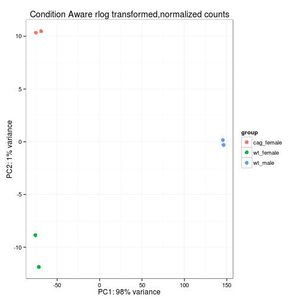 

```r
cag_dmrt1_dds <- DESeq( cag_dmrt1_dds )
```

```
## using pre-existing size factors
## estimating dispersions
## gene-wise dispersion estimates
## mean-dispersion relationship
## final dispersion estimates
## fitting model and testing
```

```r
#plotDispEsts(cag_dmrt1_dds)
#DESeq2::plotMA(cag_dmrt1_dds)
```

###Apply contrast to create results table for ovarian expression changes

```r
cag_dmrt1F_res<-results(cag_dmrt1_dds,contrast=c("group","cag_female","wt_female"))

hist(cag_dmrt1F_res$pvalue, breaks=40, col="grey",main="Ovary P-value Distribution")
```

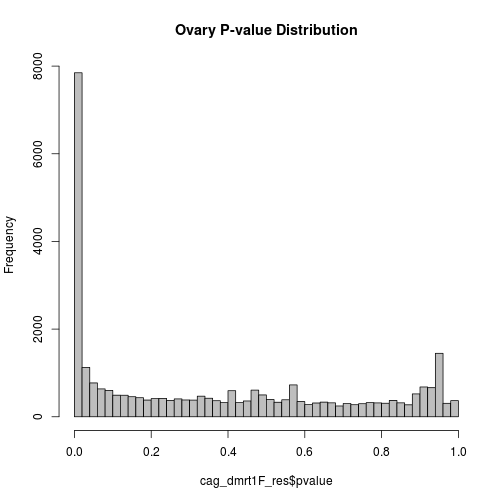 

```r
#use full results names for writing out table below
resNames<-mcols(cag_dmrt1F_res)$description
names(resNames)<-colnames(cag_dmrt1F_res)

#Convert Results to DataFrame
cag_dmrt1F_DF <-as.data.frame(cag_dmrt1F_res[!is.na(cag_dmrt1F_res$padj),])
#remove padj NAs
#cag_dmrt1F_DF<-cag_dmrt1F_DF[!is.na(cag_dmrt1F_DF$padj),]

#Add Symbol and EntrezID annotations
blah<-AnnotationDbi::select(org.Mm.eg.db,keys=rownames(cag_dmrt1F_DF),keytype="ENSEMBL",
             column=c("SYMBOL","ENTREZID"))
```

```
## Warning in .generateExtraRows(tab, keys, jointype): 'select' resulted in
## 1:many mapping between keys and return rows
```

```r
cag_dmrt1F_DF$symbol<-blah[match(rownames(cag_dmrt1F_DF),blah$ENSEMBL),"SYMBOL"]
cag_dmrt1F_DF$ENTREZID<-blah[match(rownames(cag_dmrt1F_DF),blah$ENSEMBL),"ENTREZID"]

#Add Chromosomal Location to table
temp<-as.data.frame(seqnames(exonsByGene))
temp<-temp[!duplicated(temp$group_name),]
idx<-match(rownames(cag_dmrt1F_DF),temp$group_name)
cag_dmrt1F_DF$CHR<-temp[idx,"value"]

#Now remove pseudogene artifacts on chrY
cag_dmrt1F_DF<-cag_dmrt1F_DF[cag_dmrt1F_DF$CHR!="chrY",]

#Add RA response category to table based on this 2002 paper:
#http://www.jlr.org/content/43/11/1773.full
ra<-read.csv("inst//extdata//retinoic_acid.csv",stringsAsFactors=F)
ra<-ra[,c("Symbol","Cat")]
colnames(ra)[1]<-"symbol"
ra<-ra[!is.na(ra$Cat),]
ra$symbol<-capitalize(tolower(ra$symbol))
idx<-match(tolower(cag_dmrt1F_DF$symbol),tolower(ra$symbol))
#sum(!is.na(idx)) #373 ra responsive genes expressed in ovary
cag_dmrt1F_DF$raClass<-ra[idx,"Cat"]
cag_dmrt1F_DF[is.na(cag_dmrt1F_DF$raClass),"raClass"]<-0
#table(cag_dmrt1F_DF$raClass)

#order
cag_dmrt1F_DF<-cag_dmrt1F_DF[with(cag_dmrt1F_DF,order(-log2FoldChange)),]

#Sanity Check
temp<-c("Sox9","Foxl2","Dmrt1","Pou5f1","Gapdh","Hsd17b3","Insl3","Cyp19a1")
cag_dmrt1F_DF[cag_dmrt1F_DF$symbol %in% temp,]
```

```
##                    baseMean log2FoldChange  lfcSE     stat     pvalue
## ENSMUSG00000024837    805.2        10.0180 0.7005  14.3019  2.128e-46
## ENSMUSG00000000567   1580.2         6.7422 0.2836  23.7756 5.978e-125
## ENSMUSG00000033122    379.6         4.9031 0.6407   7.6522  1.975e-14
## ENSMUSG00000079019    272.7         4.0592 0.5583   7.2703  3.587e-13
## ENSMUSG00000024406     82.9        -0.1040 0.3705  -0.2807  7.790e-01
## ENSMUSG00000057666   1412.9        -0.5657 0.2170  -2.6068  9.138e-03
## ENSMUSG00000050397   1573.5        -1.9407 0.2299  -8.4405  3.161e-17
## ENSMUSG00000032274    255.6        -5.2161 0.3648 -14.2996  2.201e-46
##                          padj  symbol ENTREZID   CHR raClass
## ENSMUSG00000024837  3.762e-44   Dmrt1    50796 chr19       0
## ENSMUSG00000000567 1.933e-121    Sox9    20682 chr11       1
## ENSMUSG00000033122  4.994e-13 Hsd17b3    15487 chr13       0
## ENSMUSG00000079019  7.898e-12   Insl3    16336  chr8       0
## ENSMUSG00000024406  8.829e-01  Pou5f1    18999 chr17       1
## ENSMUSG00000057666  3.005e-02   Gapdh    14433  chr6       0
## ENSMUSG00000050397  1.032e-15   Foxl2    26927  chr9       0
## ENSMUSG00000032274  3.862e-44 Cyp19a1    13075  chr9       0
```

```r
cag_dmrt1F_DF[cag_dmrt1F_DF$raClass==3,]
```

```
##                    baseMean log2FoldChange  lfcSE     stat    pvalue
## ENSMUSG00000027513   51.886         2.5022 1.9325   1.2948 1.954e-01
## ENSMUSG00000029844   11.685         2.4844 0.9509   2.6128 8.981e-03
## ENSMUSG00000029084  345.344         2.0131 0.2224   9.0511 1.416e-19
## ENSMUSG00000037820 4522.782         1.9841 0.3302   6.0083 1.875e-09
## ENSMUSG00000026770   33.011         1.9585 0.6377   3.0712 2.132e-03
## ENSMUSG00000046402 1968.503         1.9139 0.3042   6.2920 3.134e-10
## ENSMUSG00000032259   95.294         1.8663 0.6823   2.7351 6.236e-03
## ENSMUSG00000037992  868.568         1.3261 0.2401   5.5231 3.331e-08
## ENSMUSG00000000942  465.391         0.4992 0.4312   1.1577 2.470e-01
## ENSMUSG00000032060  240.745         0.2997 0.3447   0.8694 3.846e-01
## ENSMUSG00000038692   30.022        -0.1173 0.6987  -0.1679 8.666e-01
## ENSMUSG00000032035  806.047        -0.2315 0.2060  -1.1240 2.610e-01
## ENSMUSG00000017491   60.709        -0.4013 0.6894  -0.5822 5.605e-01
## ENSMUSG00000052435    7.022        -0.7800 1.1879  -0.6567 5.114e-01
## ENSMUSG00000038418 1021.962        -1.0715 0.5175  -2.0703 3.842e-02
## ENSMUSG00000001288  400.140        -1.0928 0.3381  -3.2320 1.229e-03
## ENSMUSG00000019301 2067.431        -3.6494 0.3387 -10.7749 4.523e-27
## ENSMUSG00000004885  173.108        -4.0008 0.4384  -9.1260 7.105e-20
##                         padj  symbol ENTREZID   CHR raClass
## ENSMUSG00000027513 3.481e-01    Pck1    18534  chr2       3
## ENSMUSG00000029844 2.966e-02   Hoxa1    15394  chr6       3
## ENSMUSG00000029084 5.611e-18    Cd38    12494  chr5       3
## ENSMUSG00000037820 2.639e-08    Tgm2    21817  chr2       3
## ENSMUSG00000026770 8.665e-03   Il2ra    16184  chr2       3
## ENSMUSG00000046402 4.902e-09    Rbp1    19659  chr9       3
## ENSMUSG00000032259 2.174e-02    Drd2    13489  chr9       3
## ENSMUSG00000037992 3.891e-07    Rara    19401 chr11       3
## ENSMUSG00000000942 4.118e-01   Hoxa4    15401  chr6       3
## ENSMUSG00000032060 5.581e-01   Cryab    12955  chr9       3
## ENSMUSG00000038692 9.386e-01   Hoxb4    15412 chr11       3
## ENSMUSG00000032035 4.283e-01    Ets1    23871  chr9       3
## ENSMUSG00000017491 7.152e-01    Rarb   218772 chr14       3
## ENSMUSG00000052435 6.753e-01   Cebpe   110794 chr14       3
## ENSMUSG00000038418 9.837e-02    Egr1    13653 chr18       3
## ENSMUSG00000001288 5.399e-03    Rarg    19411 chr15       3
## ENSMUSG00000019301 3.002e-25 Hsd17b1    15485 chr11       3
## ENSMUSG00000004885 2.866e-18  Crabp2    12904  chr3       3
```

```r
#Subset DataFrame with Significantly Enriched Dmrt1 Genes
cag_dmrt1F_DF_subset<-cag_dmrt1F_DF[which(cag_dmrt1F_DF$padj < 0.05 &
                                            abs(cag_dmrt1F_DF$log2FoldChange) > 1),]
nrow(subset(cag_dmrt1F_DF_subset,log2FoldChange >1))
```

```
## [1] 2430
```

```r
nrow(subset(cag_dmrt1F_DF_subset,log2FoldChange <1))
```

```
## [1] 2078
```

# Enrichment tests for Chromosome Location and Retinoic Acid Responsive Genes

## Chromosomal location Hypergeometric Tests
Many of the highly differentially expressed genes were on the X chromosome.    To determine if there are more genes than expected, this section performs a hypergeometric tests.


```r
total_balls<-table(cag_dmrt1F_DF$CHR)
drawn_balls<-table(cag_dmrt1F_DF_subset$CHR)
chrdata<-as.data.frame(rbind(total_balls,drawn_balls,pval=0))

calcHyper<-function (chrome) {
  (q<-chrdata["drawn_balls",chrome]) #number of white balls drawn from urn
  (k<-sum(chrdata["drawn_balls",])) #total number of balls drawn from urn
  (m<-chrdata["total_balls",chrome]) #number of white balls in the urn
  (n<-sum(chrdata["total_balls",])-m) #number of black balls in the urn
phyper(q,m,n,k,lower.tail = FALSE)
}

for (i in colnames(chrdata)) {chrdata["pval",i]<-calcHyper(i)}
chrdata<-t(chrdata)
chrdata[,"pval"]<-p.adjust(chrdata[,"pval"],"BH")
chrdata
```

```
##       total_balls drawn_balls   pval
## chr1         1285         272 0.3759
## chr2         1937         352 0.9799
## chr3         1044         233 0.1143
## chr4         1588         315 0.8884
## chr5         1376         273 0.8884
## chr6         1110         248 0.1143
## chr7         1645         343 0.3882
## chr8         1086         190 0.9799
## chr9         1163         236 0.7204
## chr10         969         206 0.3759
## chr11        1832         339 0.9799
## chr12         745         142 0.9589
## chr13         848         164 0.9562
## chr14         953         165 0.9799
## chr15         801         181 0.1143
## chr16         662         118 0.9799
## chr17        1045         215 0.6217
## chr18         529         102 0.9562
## chr19         673         127 0.9589
## chrX         1324         287 0.1773
## chrY            0           0 0.0000
## chrM            0           0 0.0000
```

```r
#cag_dmrt1F_DF_subset[cag_dmrt1F_DF_subset$CHR=="chrX",]$symbol
```

## GSEA & Supplemental Table 1b
To determine if the magnitude of these changes is significant, calculate the average LogFC for each chromosome using Gene Set Enrichment Analysis following the protocol described here:  http://bioconductor.org/help/course-materials/2013/BioC2013/DESeq2_parathyroid.pdf


```r
res2<-cag_dmrt1F_DF
res2$ENSEMBL<-rownames(res2)
incm <- do.call( rbind, with(res2, tapply(ENSEMBL, CHR, function(x) CHR == res2[x,"CHR"] ) ))
colnames(incm) <- res2$ENSEMBL
#str(incm)
rowSums(incm)
```

```
##  chr1  chr2  chr3  chr4  chr5  chr6  chr7  chr8  chr9 chr10 chr11 chr12 
##  1285  1937  1044  1588  1376  1110  1645  1086  1163   969  1832   745 
## chr13 chr14 chr15 chr16 chr17 chr18 chr19  chrX 
##   848   953   801   662  1045   529   673  1324
```

```r
mean(colSums(incm)==1)
```

```
## [1] 1
```

```r
testCategory <- function( chr ) {
isMember <- incm[ chr, ]
data.frame(
chr = chr,
numGenes = sum( isMember ),
avgLFC = mean( res2$log2FoldChange[isMember] ),
strength = sum( res2$log2FoldChange[isMember] ) / sqrt(sum(isMember)),
pvalue = t.test( res2$log2FoldChange[ isMember ] )$p.value,
CHR = chr) }


gsea<-do.call( rbind, lapply( rownames(incm)[1:20], testCategory ) )
sum(gsea$numGenes)
```

```
## [1] 22615
```

```r
gsea$padj<-p.adjust(gsea$pvalue,"BH")
gsea<-gsea[,c("chr","numGenes","avgLFC","strength","pvalue","padj")]
colnames(gsea)<-c("chr","gsea_numGenes","gsea_avgLFC","gsea_strength","gsea_pvalue","gsea_padj")
chrdata<-merge(chrdata,gsea,by.x=0,by.y="chr")
rownames(chrdata)<-chrdata[,1]
chrdata<-chrdata[,c("total_balls","drawn_balls","pval","gsea_avgLFC",
                    "gsea_strength","gsea_padj")]
colnames(chrdata)<-c("Genes_in_Catagory","Enriched_Genes_in_Catagory","Hypergeometeric_padj",
                     "GSEA_avgLFC","GSEA_strength","GSEA_padj")
(chrdata<-chrdata[paste0("chr",c(1:19,"X")),])
```

```
##       Genes_in_Catagory Enriched_Genes_in_Catagory Hypergeometeric_padj
## chr1               1285                        272               0.3759
## chr2               1937                        352               0.9799
## chr3               1044                        233               0.1143
## chr4               1588                        315               0.8884
## chr5               1376                        273               0.8884
## chr6               1110                        248               0.1143
## chr7               1645                        343               0.3882
## chr8               1086                        190               0.9799
## chr9               1163                        236               0.7204
## chr10               969                        206               0.3759
## chr11              1832                        339               0.9799
## chr12               745                        142               0.9589
## chr13               848                        164               0.9562
## chr14               953                        165               0.9799
## chr15               801                        181               0.1143
## chr16               662                        118               0.9799
## chr17              1045                        215               0.6217
## chr18               529                        102               0.9562
## chr19               673                        127               0.9589
## chrX               1324                        287               0.1773
##       GSEA_avgLFC GSEA_strength         GSEA_padj
## chr1     0.009484       0.33998 0.844540491089303
## chr2     0.030391       1.33756 0.536965499033337
## chr3     0.062305       2.01312 0.443869793483080
## chr4     0.016560       0.65993 0.785049813181479
## chr5     0.053002       1.96607 0.443869793483080
## chr6     0.020937       0.69756 0.785049813181479
## chr7     0.066303       2.68916 0.392877623894956
## chr8     0.002089       0.06883 0.954330923448036
## chr9     0.044708       1.52467 0.483734489060666
## chr10    0.100306       3.12241 0.143270119141266
## chr11   -0.041571      -1.77931 0.443869793483080
## chr12    0.019901       0.54319 0.785049813181479
## chr13   -0.127025      -3.69901 0.143270119141266
## chr14    0.062342       1.92453 0.443869793483080
## chr15    0.064917       1.83728 0.443869793483080
## chr16    0.013863       0.35668 0.844540491089303
## chr17    0.019024       0.61499 0.785049813181479
## chr18   -0.057870      -1.33100 0.536965499033337
## chr19    0.039250       1.01824 0.659877050494093
## chrX     0.420428      15.29803 0.000000000003242
```

```r
#Center the avglogFC values
chrdata$GSEA_avgLFC<-chrdata$GSEA_avgLFC-mean(chrdata$GSEA_avgLFC)

#write.csv(chrdata,file="Supplemental_Table_1b.csv",quote=F)
```
<div class="pagebreak"></div>

## GSEA on Retinoic Acid Responsive Genes
Perform hypergeometric and GSEA test to see if there is a statistically significant number or degree of upregulation of Retinoic Responsive genes among the differentially expressed genes.


```r
#Hypergeometric Test
total_balls<-table(cag_dmrt1F_DF$raClass)
drawn_balls<-table(cag_dmrt1F_DF_subset$raClass)
radata<-as.data.frame(rbind(total_balls,drawn_balls,pval=0))

calcHyper<-function (cat) {
  (q<-radata["drawn_balls",cat]) #number of white balls drawn from urn
  (k<-sum(radata["drawn_balls",])) #total number of balls drawn from urn
  (m<-radata["total_balls",cat]) #number of white balls in the urn
  (n<-sum(radata["total_balls",])-m) #number of black balls in the urn
phyper(q,m,n,k,lower.tail = FALSE)
}

for (i in colnames(radata)) {radata["pval",i]<-calcHyper(i)}
radata<-t(radata)
radata[,"pval"]<-p.adjust(radata[,"pval"],"BH")
radata
```

```
##   total_balls drawn_balls          pval
## 0       22337        4410 0.99999999848
## 1         195          72 0.00000004134
## 2          65          16 0.18167649896
## 3          18          10 0.00030630092
```

```r
#GSEA-like test

incm <- do.call( rbind, with(res2, tapply(ENSEMBL, raClass, function(x) raClass == res2[x,"raClass"] ) ))
colnames(incm) <- res2$ENSEMBL
str(incm)
```

```
##  logi [1:4, 1:22615] TRUE FALSE FALSE FALSE TRUE FALSE ...
##  - attr(*, "dimnames")=List of 2
##   ..$ : chr [1:4] "0" "1" "2" "3"
##   ..$ : chr [1:22615] "ENSMUSG00000082071" "ENSMUSG00000034891" "ENSMUSG00000036832" "ENSMUSG00000079476" ...
```

```r
rowSums(incm)
```

```
##     0     1     2     3 
## 22337   195    65    18
```

```r
mean(colSums(incm)==1)
```

```
## [1] 1
```

```r
testCategory <- function( cat ) {
isMember <- incm[ cat, ]
data.frame(
cat = cat,
numGenes = sum( isMember ),
GSEA_avgLFC = mean( res2$log2FoldChange[isMember] ),
GSEA_strength = sum( res2$log2FoldChange[isMember] ) / sqrt(sum(isMember)),
GSEA_pval = t.test( res2$log2FoldChange[ isMember ] )$p.value) }

gseaRA<-do.call( rbind, lapply( rownames(incm), testCategory ) )
gseaRA$GSEA_pval<-p.adjust(gseaRA$GSEA_pval,"BH")

#combine into table
radata<-merge(radata,gseaRA,by.x=0,by.y="cat")
rownames(radata)<-paste0("RA Response Class ",radata[,1])
radata<-radata[,c("total_balls","drawn_balls","pval","GSEA_avgLFC",
                    "GSEA_strength","GSEA_pval")]
colnames(radata)<-c("Genes_in_Catagory","Enriched_Genes_in_Catagory","Hypergeometeric_padj",
                     "GSEA_avgLFC","GSEA_strength","GSEA_padj")

temp<-rbind(chrdata,radata)
write.csv(temp,file="Supplemental_Table_1b.csv",quote=F)
```


## Vizualize ChrX Enrichment - Figure S2
Create figures for the Chromosome X data to be included in the supplement.

### Supplemental Figure S2A - Ideogram

```r
# Subset genes that are list
log5_enriched<-subset(cag_dmrt1F_DF,abs(log2FoldChange)>5)

#download mm9 Ideogram
#mm9IdeogramCyto <- getIdeogram("mm9", cytoband = TRUE)
#save(mm9IdeogramCyto,file="mm9IdeogramCyto.rdata")
load("inst/extdata/mm9IdeogramCyto.rdata")
seqlevelsStyle(mm9IdeogramCyto)
```

```
## [1] "UCSC"
```

```r
seqlevels(mm9IdeogramCyto)
```

```
##  [1] "chr1"  "chr2"  "chr3"  "chr4"  "chr5"  "chr6"  "chr7"  "chr8" 
##  [9] "chr9"  "chr10" "chr11" "chr12" "chr13" "chr14" "chr15" "chr16"
## [17] "chr17" "chr18" "chr19" "chrX"
```

```r
seqlengths(mm9IdeogramCyto)
```

```
##      chr1      chr2      chr3      chr4      chr5      chr6      chr7 
## 197195432 181748087 159599783 155630120 152537259 149517037 152524553 
##      chr8      chr9     chr10     chr11     chr12     chr13     chr14 
## 131738871 124076172 129993255 121843856 121257530 120284312 125194864 
##     chr15     chr16     chr17     chr18     chr19      chrX 
## 103494974  98319150  95272651  90772031  61342430 166650296
```

```r
mm9IdeogramCyto<-keepSeqlevels(mm9IdeogramCyto,paste0("chr",c(1:19,"X")))

#Create a GRanges object
log5_genes<-genes[rownames(log5_enriched)]
log5_genes<-keepSeqlevels(log5_genes,paste0("chr",c(1:19,"X")))
seqlengths(log5_genes)<-seqlengths(mm9IdeogramCyto)
log5_genes$lfc<-log5_enriched$log2FoldChange

p <- ggplot(mm9IdeogramCyto) + layout_karyogram(cytoband = FALSE)  +theme_bw()
p <- p + layout_karyogram(log5_genes, geom = "rect", ylim = c(11, 21), color = "red")
p
```

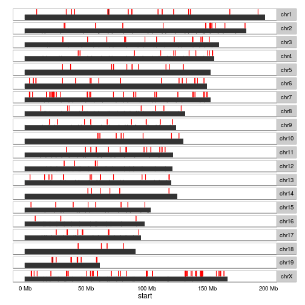 
<div class="pagebreak"></div>

### Supplemental Figure S2C - PieChart


```r
#Set up Color Palette
colors <- brewer.pal(4, "YlOrRd")
pal <- colorRampPalette(colors)

#pie chart
(num_onX<-nrow(subset(log5_enriched,CHR=="chrX")))
(total<-nrow(log5_enriched))
num_onX/total

temp<-as.data.frame(table(log5_enriched[,"CHR"]))
temp<-temp[temp$Var1 %in% paste0("chr",c(1:19,"X")), ]
colnames(temp)<-c("Chromosome","Number_of_Enriched_Genes")
temp$Chromosome<-droplevels(temp$Chromosome)

pie<-ggplot(temp,aes(x=factor(1), y=Number_of_Enriched_Genes) ) +
       geom_bar(aes(fill=Chromosome),width = 1,stat="identity",colour="black") +
       coord_polar(theta=c("y")) + theme_bw()+
       geom_text(aes(x=1.7,y = 250, label = "chrX")) +
       scale_fill_manual(values=pal(20))

save(pie,file="inst/extdata/pie.rdata")
```


```r
load("inst/extdata/pie.rdata")
pie
```

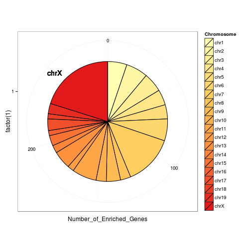 

<div class="pagebreak"></div>

### Alternative to Figure S2B - Boxplots of Log2Fold Changes

```r
#Set up Color Palette
colors <- brewer.pal(4, "YlOrRd")
pal <- colorRampPalette(colors)

temp<-cag_dmrt1F_DF
temp<-temp[temp$CHR %in% paste0("chr",c(1:19,"X")),]
temp$CHR<-droplevels(temp$CHR)
#levels(temp$CHR)<-rev(levels(temp$CHR))

q2<-ggplot(temp,aes(x=CHR,y=log2FoldChange,fill=CHR)) + theme_bw()+
  geom_boxplot(aes(fill=CHR))+
  scale_fill_manual(values=pal(20)) +
  theme(axis.text.x = element_text(angle = 90, vjust = 0.5, hjust=1)) +
  labs(x=NULL,y="Log2 Fold Change")+
  coord_flip()+scale_x_discrete(limits=c(paste0("chr",c("X",19:1)))) +
  ylim(-8,12) + theme(legend.position="none")
#q2
```


### Supplemental Figure S2D - Gene Set Enrichment Score Plot

```r
#Plot AvgLFC across chromosomes
temp<-data.frame(score=chrdata$GSEA_strength,chromosome=rownames(chrdata))
levels(temp$chromosome)<-rev(rownames(chrdata))
temp<-melt(temp,value.name="score")

q1<-data.frame(score=chrdata$GSEA_strength,
               chromosome=factor(rownames(chrdata),levels=paste0("chr",c(1:19,"X")))
               ) %>%
   ggplot(aes(x=chromosome,y=score)) +
   geom_bar(aes(fill=chromosome),stat = "identity",color="black") + theme_bw() +
   theme(axis.text.x = element_text(angle = 90, vjust = 0.5, hjust=1)) +
   coord_flip() + scale_x_discrete(limits=c(paste0("chr",c("X",19:1))))+
   labs(y="Enrichment Score",x="Chromosome") +scale_fill_manual(values=pal(20)) +
   theme(legend.position="none")
q1
save(q1,file="inst/extdata/q1.rdata")
```

### Supplemental Figure S2  

```r
load("inst/extdata/q1.rdata")
grid.arrange(q2,q1,ncol=2,main="A Subset of Genes on Chromosome X are Highly Upregulated")
```

```
## Warning: Removed 1 rows containing non-finite values (stat_boxplot).
```

```
## Warning: Stacking not well defined when ymin != 0
```

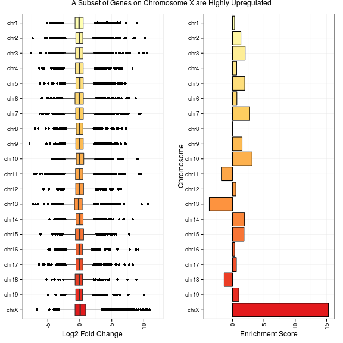 
<div class="pagebreak"></div>

## Create a heatmap to visualize extent of transdifferentiation -- Figure 3A
Plot FPKM values for wild type and mutant ovary next to expression values for testis.   Rather than create clusters, sort the genes from female enriched (top) to male enriched(bottom) and vizualize mutant ovaries in between.

```r
#Normalize the Entire Dataset
#cag_dds <- DESeqDataSet(cag_dmrt1, design = ~1   )
#cag_dds <- estimateSizeFactors(cag_dds )
#sizeFactors(cag_dds)
#colSums(counts(cag_dds))


#extract fpkm values
#rd<-as.data.frame(fpkm(cag_dmrt1_dds))
rd<-as.data.frame(fpkm(cag_dmrt1_dds))

#subset for differentially expressed genes
rd<-rd[rownames(rd) %in% rownames(subset(cag_dmrt1F_DF,abs(log2FoldChange) >2)),]
rd<-rd[,c(3,4,1,2,5,6)]

#rd4<-rd3
#Order data from Female to Male
rd$sex_ratio <- (rd[,5]+rd[,6])/(rd[,1]+rd[,2])
rd<-rd[with(rd,order(sex_ratio)),1:6]

#create a factor label for gender
labels<-as.factor(c("Female","Female","Female","Female","Male","Male"))
labels<-relevel(labels, "Male")
aheatmap(log2(rd+0.25),Rowv=NA,Colv=NA,color="PRGn",scale="row", annCol=labels)
```

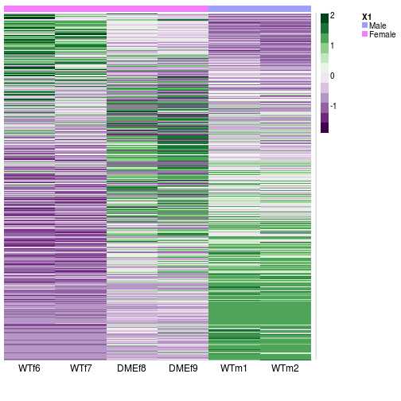 

<div class="pagebreak"></div>
# WT Ovary vs Testis RNA-Seq

## Use wt RNA-SEQ to Identify Male and Female Specific Genes


```r
WT_res<-results(cag_dmrt1_dds, contrast=c("group","wt_male","wt_female"))
hist(WT_res$pvalue, breaks=40, col="grey")
```

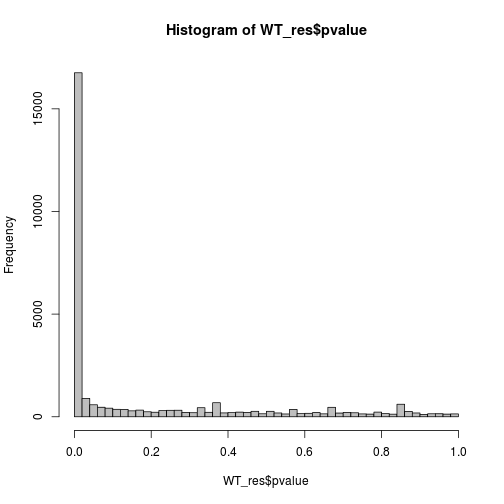 

```r
#Annotate with Gene Symbol
blah<-AnnotationDbi::select(org.Mm.eg.db,keys=rownames(WT_res),keytype="ENSEMBL",column="SYMBOL")
```

```
## Warning in .generateExtraRows(tab, keys, jointype): 'select' resulted in
## 1:many mapping between keys and return rows
```

```r
WT_res$symbol<-blah[match(rownames(WT_res),blah$ENSEMBL),"SYMBOL"]

#Sanity Check
temp<-c("Sox9","Foxl2","Dmrt1","Pou5f1","Gapdh","Hsd17b3","Insl3","Cyp19a1")
WT_res[WT_res$symbol %in% temp,]
```

```
## log2 fold change (MAP): group wt_male vs wt_female 
## Wald test p-value: group wt_male vs wt_female 
## DataFrame with 8 rows and 7 columns
##                     baseMean log2FoldChange     lfcSE      stat    pvalue
##                    <numeric>      <numeric> <numeric> <numeric> <numeric>
## ENSMUSG00000000567    1580.2         3.3317    0.2905    11.470 1.863e-30
## ENSMUSG00000024406      82.9         0.6169    0.3711     1.662 9.641e-02
## ENSMUSG00000024837     805.2         8.8763    0.7016    12.652 1.097e-36
## ENSMUSG00000032274     255.6        -0.6262    0.2452    -2.554 1.066e-02
## ENSMUSG00000033122     379.6         5.4699    0.6410     8.534 1.418e-17
## ENSMUSG00000050397    1573.5        -9.2942    0.5643   -16.471 5.948e-61
## ENSMUSG00000057666    1412.9        -3.0145    0.2286   -13.189 1.014e-39
## ENSMUSG00000079019     272.7         5.7801    0.5561    10.395 2.621e-25
##                         padj      symbol
##                    <numeric> <character>
## ENSMUSG00000000567 1.338e-29        Sox9
## ENSMUSG00000024406 1.296e-01      Pou5f1
## ENSMUSG00000024837 9.514e-36       Dmrt1
## ENSMUSG00000032274 1.697e-02     Cyp19a1
## ENSMUSG00000033122 6.288e-17     Hsd17b3
## ENSMUSG00000050397 8.992e-60       Foxl2
## ENSMUSG00000057666 9.666e-39       Gapdh
## ENSMUSG00000079019 1.573e-24       Insl3
```

```r
WT_resDF<-as.data.frame(WT_res)
#remove NAs
WT_resDF<-WT_resDF[!is.na(WT_resDF$padj),]
maleSig<-rownames(WT_resDF[WT_resDF$log2FoldChange>2,])
femaleSig<-rownames(WT_resDF[-1*WT_resDF$log2FoldChange>2,])
length(maleSig)
```

```
## [1] 7517
```

```r
length(femaleSig)
```

```
## [1] 4419
```


## Supplemental Table 1a
Combine the "Ovary vs CAG Ovary"" and "Ovary vs Testis" datasets to answer questions about the extent of transformation and create a "super table" of all the important information.


```r
#first calculate percent of male specific genes 
sum(rownames(subset(cag_dmrt1F_DF_subset,log2FoldChange<0)) %in% femaleSig) / length(femaleSig)
```

```
## [1] 0.1951
```

```r
#first calculate percent of male specific genes 
sum(rownames(subset(cag_dmrt1F_DF_subset,log2FoldChange>0)) %in% maleSig) / length(maleSig)
```

```
## [1] 0.1231
```

```r
#merge WT logFC into "Supertable"
#head(cag_dmrt1F_DF_subset)
supertable<-cag_dmrt1F_DF_subset
idx<-match(rownames(supertable),rownames(WT_resDF))
supertable$"log2 fold change: Testis vs Ovary"<-WT_resDF[idx,"log2FoldChange"]
supertable$"BH adjusted p-Value: Testis vs Ovary"<-WT_resDF[idx,"padj"]
idx<-match(colnames(supertable),names(resNames))
idx<-idx[!is.na(idx)]
colnames(supertable)[idx]<-resNames
#head(supertable)
write.csv(supertable,file="Supplementary_Table_1a.csv",quote=F)
```

# Compare DMRT1 Overexpression to FOXL2 KO Microarrays 

##Download published micrarray data from NCBI (GSE16853)


```r
# From GEO2R
gset <- getGEO("GSE16853", GSEMatrix =TRUE,destdir=".")
if (length(gset) > 1) idx <- grep("GPL6246", attr(gset, "names")) else idx <- 1
gset <- gset[[idx]]

# make proper column names to match toptable 
fvarLabels(gset) <- make.names(fvarLabels(gset))

# group names for all samples
sml <- c("X","X","X","G0","G0","G1","G1","G1");

# eliminate samples marked as "X"
sel <- which(sml != "X")
sml <- sml[sel]
gset <- gset[ ,sel]

# log2 transform
ex <- exprs(gset)
qx <- as.numeric(quantile(ex, c(0., 0.25, 0.5, 0.75, 0.99, 1.0), na.rm=T))
LogC <- (qx[5] > 100) ||
          (qx[6]-qx[1] > 50 && qx[2] > 0) ||
          (qx[2] > 0 && qx[2] < 1 && qx[4] > 1 && qx[4] < 2)
if (LogC) { ex[which(ex <= 0)] <- NaN
  exprs(gset) <- log2(ex) }

# set up the data and proceed with analysis
fl <- as.factor(sml)
gset$description <- fl
design <- model.matrix(~ description + 0, gset)
colnames(design) <- levels(fl)
fit <- lmFit(gset, design)
cont.matrix <- makeContrasts(G1-G0, levels=design)
fit2 <- contrasts.fit(fit, cont.matrix)
fit2 <- eBayes(fit2, 0.01)
tT <- topTable(fit2, adjust="fdr", sort.by="B", number=Inf)
head(tT[tT$adj.P.Val<0.05 & abs(tT$logFC) > 2,])

# load NCBI platform annotation
gpl <- annotation(gset)
platf <- getGEO(gpl, AnnotGPL=TRUE,destdir=".")
ncbifd <- data.frame(attr(dataTable(platf), "table"))

# replace original platform annotation
tT <- tT[setdiff(colnames(tT), setdiff(fvarLabels(gset), "ID"))]
tT <- merge(tT, ncbifd, by="ID")
tT <- tT[order(tT$P.Value), ]  # restore correct order
colnames(tT)
tT_foxl2_KO <- subset(tT, select=c("ID","adj.P.Val","P.Value","t","B","logFC","Gene.symbol","Gene.ID"))

#take minimum adj.P.Val
tT_foxl2_KO<-tT_foxl2_KO[with(tT_foxl2_KO,order(adj.P.Val)),]
tT_foxl2_KO<-tT_foxl2_KO[!duplicated(tT_foxl2_KO$Gene.ID),]

# Gene.ID's differentially expressed in Microarray Dataset
#tT2<-tT2[tT2$adj.P.Val < 0.05,]
nrow(tT_foxl2_KO)
head(tT_foxl2_KO)

save(tT_foxl2_KO,file="foxl2_ko_DEGs.rdata")
```


## Compare DMRT1 Overexpression to FOXL2 Knockout

```r
load("inst/extdata/foxl2_ko_DEGs.rdata")
#Use NCBI GeneIDs to match Microarray Data to RNA-Seq
idx<-match(tT_foxl2_KO$Gene.ID,cag_dmrt1F_DF$ENTREZID)
tT_foxl2_KO$cag_dmrt1F_logFC<-cag_dmrt1F_DF[idx,"log2FoldChange"]
tT_foxl2_KO$cag_dmrt1F_padj<-cag_dmrt1F_DF[idx,"padj"]
tT_foxl2_KO$chr<-cag_dmrt1F_DF[idx,"CHR"]
tT_foxl2_KO$ENSEMBL<-rownames(cag_dmrt1F_DF[idx,])

#Check for NAs
mean(is.na(tT_foxl2_KO$cag_dmrt1F_logFC))
```

```
## [1] 0.4938
```

```r
#Filter out NAs
tT3<-tT_foxl2_KO[!is.na(tT_foxl2_KO$cag_dmrt1F_logFC),]
tT3$Gene.symbol<-as.character(tT3$Gene.symbol)
tT3$Gene.ID<-as.character(tT3$Gene.ID)
nrow(tT3)
```

```
## [1] 17998
```

```r
#Sanity Check
temp<-c("Wnt4","Etd","Hsd17b3","Insl3","Cyp19a1")
tT3[tT3$Gene.symbol %in% temp,]
```

```
##             ID adj.P.Val   P.Value       t      B    logFC Gene.symbol
## 33566 10593652  0.008445 0.0000608 -9.8800  2.541 -4.95567     Cyp19a1
## 13537 10410065  0.097286 0.0067476  4.0411 -2.518  0.89774     Hsd17b3
## 34250 10599650  0.175159 0.0206845  3.1128 -3.728  0.69994         Etd
## 24176 10509267  0.927817 0.7890756 -0.2797 -7.009 -0.06956        Wnt4
##       Gene.ID cag_dmrt1F_logFC cag_dmrt1F_padj   chr            ENSEMBL
## 33566   13075          -5.2161       3.862e-44  chr9 ENSMUSG00000032274
## 13537   15487           4.9031       4.994e-13 chr13 ENSMUSG00000033122
## 34250   69501           9.8904       1.487e-44  chrX ENSMUSG00000060967
## 24176   22417          -0.9879       4.094e-03  chr4 ENSMUSG00000036856
```

```r
#Filter out genes not differentially expressed in either sample
nrow(tT3<-subset(tT3,adj.P.Val<0.05 | cag_dmrt1F_padj < 0.05))
```

```
## [1] 7223
```

```r
#Use the following code to identify outliers
#plot(tT3$logFC,tT3$cag_dmrt1F_logFC,pch=13,cex=0.2,
#     xlim=c(-11,11),ylim=c(-11,11),
#     xlab="FOXL2 KO logFC",ylab="DMRT1 OE logFC",
#     main="FOXL2 vs DMRT1 in the Ovary")
#identify(tT3$logFC,tT3$cag_dmrt1F_logFC,labels=tT3$Gene.symbol)

#Add a color code for whether a gene is Male Enriched or Female Enriched
tT3$enrich<-"none"
tT3[tT3$ENSEMBL %in% maleSig,"enrich"]<-"Male Enriched"
tT3[tT3$ENSEMBL %in% femaleSig,"enrich"]<-"Female Enriched"
tT3$chrX<-tT3$chr=="chrX"
```

<div class="pagebreak"></div>
## Figure 3B Scatterplot
Plot the DMRT1 overexpression data vs the FOXL2 knockout data with color coding for sex-specific gene expression.


```r
scattertT3 <- function (genes) {
p<-ggplot(tT3,aes(x=tT3$logFC,y=tT3$cag_dmrt1F_logFC,color=enrich))
p<- p +  geom_point(size=ifelse(tT3$chrX,4,2),shape=ifelse(tT3$chrX,17,16)) +
  scale_colour_manual(values=c("red", "blue","gray")) +
  annotate("rect",xmin=-1, xmax=1, ymin=4, ymax=Inf, fill="blue",alpha=0.25) +
  annotate("rect",xmin=-1, xmax=1, ymin=-4, ymax=-Inf, fill="pink",alpha=0.25) +
  #horizontal boxes
  #annotate("rect",xmin=1, xmax=Inf, ymin=-1, ymax=1, fill="gray",alpha=0.25) +
  #annotate("rect",xmin=-Inf, xmax=-1, ymin=-1, ymax=1, fill="gray",alpha=0.25) +
  ylim(-11,11) + xlim(-6,6) +
  xlab("FOXL2 KO logFC") + ylab("DMRT1 OE logFC") +
  ggtitle("FOXL2 vs DMRT1 in the Ovary") +
  guides(color=FALSE,shape=FALSE) +
  theme_bw() 

labels<-tT3[tT3$Gene.symbol %in% genes,]

p+annotate("text",x=labels$logFC, y=labels$cag_dmrt1F_logFC,label=labels$Gene.symbol)


}

scattertT3(c("Dmrt1","Foxl2","Etd","Dhh","Sncb","Cyp19a1",
             "Esr2","Wnt4","Ptgfr","Adcyap1","Defb36","Cst9","Hsd17b3"))
```

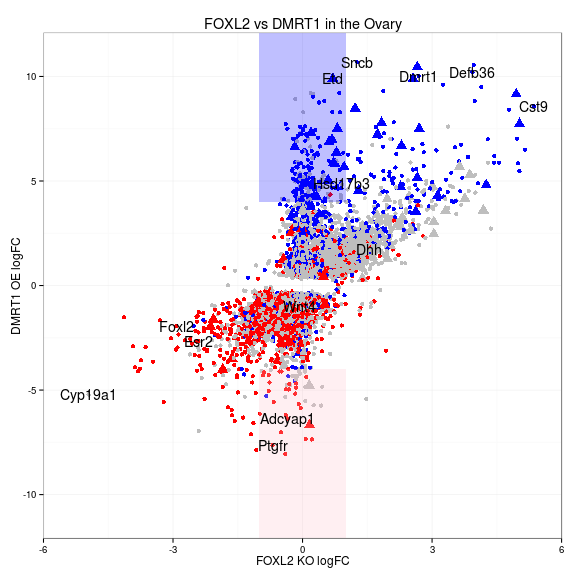 
<div class="pagebreak"></div>


# Single Cell Analysis

The single cell Nextera libraries were first sequenced on a paired end MiSeq run.  Once we knew that the experiment worked, we went and sequenced the same library at a greater depth on the HiSeq 2000 as a single end 50 bp read.  We mapped each run separately and did comparative data exploration before the count tables were combined for the downstream analysis.

##Map MiSeq Reads

```r
dd=/home/zarkowe0/data_release/umgc/miseq/140710_M00784_0131_000000000-AA30P_Analysis/
wd=/home/bardwell/gearhart/dmrt1/ctv/single
org=mm9


for i in cDNA-002-C12_S47 cDNA-002-C13_S53 cDNA-002-C16_S5 cDNA-002-C17_S64 cDNA-002-C18_S22 cDNA-002-C19_S6 cDNA-002-C1_S4 cDNA-002-C20_S60 cDNA-002-C21_S48 cDNA-002-C22_S58 cDNA-002-C23_S59 cDNA-002-C24_S9 cDNA-002-C26_S21 cDNA-002-C27_S66 cDNA-002-C28_S19 cDNA-002-C2_S24 cDNA-002-C31_S34 cDNA-002-C32_S35 cDNA-002-C33_S28 cDNA-002-C34_S15 cDNA-002-C36_S16 cDNA-002-C37_S30 cDNA-002-C38_S1 cDNA-002-C3_S25 cDNA-002-C41_S33 cDNA-002-C42_S10 cDNA-002-C43_S57 cDNA-002-C44_S56 cDNA-002-C46_S39 cDNA-002-C47_S61 cDNA-002-C49_S54 cDNA-002-C50_S67 cDNA-002-C52_S18 cDNA-002-C53_S23 cDNA-002-C55_S52 cDNA-002-C56_S17 cDNA-002-C57_S55 cDNA-002-C58_S14 cDNA-002-C59_S26 cDNA-002-C5_S20 cDNA-002-C62_S36 cDNA-002-C63_S63 cDNA-002-C64_S29 cDNA-002-C65_S62 cDNA-002-C66_S38 cDNA-002-C67_S45 cDNA-002-C69_S2 cDNA-002-C71_S41 cDNA-002-C72_S46 cDNA-002-C73_S49 cDNA-002-C74_S68 cDNA-002-C75_S50 cDNA-002-C77_S37 cDNA-002-C78_S44 cDNA-002-C79_S43 cDNA-002-C7_S32 cDNA-002-C82_S3 cDNA-002-C84_S31 cDNA-002-C87_S40 cDNA-002-C89_S65 cDNA-002-C91_S27 cDNA-002-C92_S13 cDNA-002-C93_S11 cDNA-002-C94_S7 cDNA-002-C96_S51 cDNA-002-C9_S8 Zarkower-021-002-PCR-Bulk_S69

#i="${file%.*}"

do

sf1="${i}_L001_R1_001.fastq"
sf2="${i}_L001_R2_001.fastq"

cat << EOF > $i.pbs
#PBS -l mem=20gb,nodes=1:ppn=1,walltime=02:00:00 
#PBS -m a
#PBS -M gearh006@umn.edu 
#PBS -q lab 

module load samtools
mkdir $wd/$i
cd $wd/$i
 
#NEXTERA Adapter removal
java -Xmx16g -jar /home/bardwell/shared/Trimmomatic-0.32/trimmomatic-0.32.jar PE \
-threads 1 -phred33 -trimlog log \
$dd/$sf1  $dd/$sf2 \
$i.R1_trimmed.fastq.gz $i.UR1_trimmed.fastq.gz \
$i.R2_trimmed.fastq.gz $i.UR2_trimmed.fastq.gz \
ILLUMINACLIP:../NexteraPE-PE.fa:2:30:10 LEADING:3 TRAILING:3 SLIDINGWINDOW:4:5 MINLEN:25 

#run fastq after cutadapt
gunzip $i.R1_trimmed.fastq.gz
/home/bardwell/shared/FastQC/fastqc -o ../fastqc $i.R1_trimmed.fastq
gunzip $i.R2_trimmed.fastq.gz
/home/bardwell/shared/FastQC/fastqc -o ../fastqc $i.R2_trimmed.fastq

#use STAR to map PE reads
/home/bardwell/shared/STAR_2.3.0e/STAR  --genomeDir /home/bardwell/shared/STAR_GENOME/$org/ \
  --runThreadN 1 --readFilesIn $i.R1_trimmed.fastq $i.R2_trimmed.fastq 

#convert sam to bam
samtools view -bS -o $i.raw.bam Aligned.out.sam 

#sort the bam file
samtools sort $i.raw.bam $i.sort

#remove duplicates
java -Xmx16g -jar /home/bardwell/shared/picard-tools-1.94/MarkDuplicates.jar \
INPUT=$i.sort.bam OUTPUT=$i.bam REMOVE_DUPLICATES=true ASSUME_SORTED=true \
METRICS_FILE=$i.metrics MAX_FILE_HANDLES_FOR_READ_ENDS_MAP=1000 VALIDATION_STRINGENCY=LENIENT 

#create the index file
samtools index $i.bam

#igvtools to make a TDF File
java -Xmx16g  -jar /home/bardwell/shared/IGVTools_2/igvtools.jar count \
-z 5 -w 25 -e 100 $i.bam $i.tdf /home/bardwell/shared/IGVTools_2/genomes/$org.genome

rm $i.sort.bam
rm $i.raw.bam

mv $i.bam $wd/
mv $i.bam.bai $wd/
mv $i.tdf $wd/
EOF

qsub $i.pbs

done
```

##Map HiSeq Reads

```r
dd=/home/zarkowe0/data_release/umgc/hiseq/140910_SN1073_0395_BC569FACXX/Project_Zarkower_Project_026
wd=/scratch2/zarkowe0/
#wd=/home/bardwell/gearhart/dmrt1/ctv/single_hiseq
org=mm9


for i in cDNA_002_C10_CGTACTAG-AGAGTAGA cDNA_002_C37_TCCTGAGC-ACTGCATA cDNA_002_C66_GGACTCCT-ACTGCATA cDNA_002_C11_TAGGCATG-CTCTCTAT  cDNA_002_C38_TAAGGCGA-TAGATCGC  cDNA_002_C67_TAGGCATG-GTAAGGAG cDNA_002_C12_TAGGCATG-AAGGAGTA  cDNA_002_C3_TCCTGAGC-TAGATCGC   cDNA_002_C69_TAAGGCGA-CTCTCTAT cDNA_002_C13_CTCTCTAC-GTAAGGAG  cDNA_002_C41_GGACTCCT-TAGATCGC  cDNA_002_C71_TAGGCATG-TAGATCGC cDNA_002_C16_TAAGGCGA-GTAAGGAG  cDNA_002_C42_CGTACTAG-CTCTCTAT  cDNA_002_C72_TAGGCATG-ACTGCATA cDNA_002_C17_CAGAGAGG-CTAAGCCT  cDNA_002_C43_CAGAGAGG-TAGATCGC  cDNA_002_C73_CTCTCTAC-TAGATCGC cDNA_002_C18_AGGCAGAA-ACTGCATA  cDNA_002_C44_CTCTCTAC-CTAAGCCT  cDNA_002_C74_GCTACGCT-AGAGTAGA cDNA_002_C19_TAAGGCGA-ACTGCATA  cDNA_002_C46_GGACTCCT-AAGGAGTA  cDNA_002_C75_CTCTCTAC-CTCTCTAT cDNA_002_C1_TAAGGCGA-AGAGTAGA   cDNA_002_C47_CAGAGAGG-GTAAGGAG  cDNA_002_C77_GGACTCCT-GTAAGGAG cDNA_002_C20_CAGAGAGG-AGAGTAGA  cDNA_002_C49_CTCTCTAC-ACTGCATA  cDNA_002_C78_TAGGCATG-AGAGTAGA cDNA_002_C21_TAGGCATG-CTAAGCCT  cDNA_002_C50_GCTACGCT-TATCCTCT  cDNA_002_C79_TAGGCATG-TATCCTCT cDNA_002_C22_CAGAGAGG-CTCTCTAT  cDNA_002_C52_AGGCAGAA-CTCTCTAT  cDNA_002_C7_TCCTGAGC-CTAAGCCT cDNA_002_C23_CAGAGAGG-TATCCTCT  cDNA_002_C53_AGGCAGAA-AAGGAGTA  cDNA_002_C82_TAAGGCGA-TATCCTCT cDNA_002_C24_CGTACTAG-TAGATCGC  cDNA_002_C55_CTCTCTAC-AGAGTAGA  cDNA_002_C84_TCCTGAGC-AAGGAGTA cDNA_002_C26_AGGCAGAA-GTAAGGAG  cDNA_002_C56_AGGCAGAA-TAGATCGC  cDNA_002_C87_GGACTCCT-CTAAGCCT cDNA_002_C27_GCTACGCT-CTCTCTAT  cDNA_002_C57_CTCTCTAC-AAGGAGTA  cDNA_002_C89_GCTACGCT-TAGATCGC cDNA_002_C28_AGGCAGAA-TATCCTCT  cDNA_002_C58_CGTACTAG-ACTGCATA  cDNA_002_C91_TCCTGAGC-TATCCTCT cDNA_002_C2_AGGCAGAA-CTAAGCCT   cDNA_002_C59_TCCTGAGC-CTCTCTAT  cDNA_002_C92_CGTACTAG-GTAAGGAG cDNA_002_C31_GGACTCCT-CTCTCTAT  cDNA_002_C5_AGGCAGAA-AGAGTAGA   cDNA_002_C93_CGTACTAG-TATCCTCT cDNA_002_C32_GGACTCCT-TATCCTCT  cDNA_002_C62_GGACTCCT-AGAGTAGA  cDNA_002_C94_TAAGGCGA-AAGGAGTA cDNA_002_C33_TCCTGAGC-AGAGTAGA  cDNA_002_C63_CAGAGAGG-AAGGAGTA  cDNA_002_C96_CTCTCTAC-TATCCTCT cDNA_002_C34_CGTACTAG-AAGGAGTA  cDNA_002_C64_TCCTGAGC-GTAAGGAG  cDNA_002_C9_TAAGGCGA-CTAAGCCT cDNA_002_C36_CGTACTAG-CTAAGCCT  cDNA_002_C65_CAGAGAGG-ACTGCATA  Zarkower_021_002_PCR_Bulk_GCTACGCT-GTAAGGAG

#i="${file%.*}"

do

if [ ! -f "${i}.bam" ]
then
  echo "Submitting $i to queue."

  sf1="${i}_L008_R1_001.fastq"
#sf2="${i}_L001_R2_001.fastq"

  cat << EOF > $i.pbs
#PBS -l mem=20gb,nodes=1:ppn=1,walltime=02:00:00 
#PBS -m a
#PBS -M gearh006@umn.edu 
#PBS -q lab 

  module load samtools
#mkdir $wd/$i
  cd $wd/$i
 
#NEXTERA Adapter removal
java -Xmx16g -jar /home/bardwell/shared/Trimmomatic-0.32/trimmomatic-0.32.jar SE \
-threads 1 -phred33 -trimlog log \
$dd/$sf1  $i.R1_trimmed.fastq.gz \
ILLUMINACLIP:../NexteraPE-PE.fa:2:30:10 LEADING:3 TRAILING:3 SLIDINGWINDOW:4:5 MINLEN:25 

#run fastq after cutadapt
gunzip $i.R1_trimmed.fastq.gz
/home/bardwell/shared/FastQC/fastqc -o ../fastqc $i.R1_trimmed.fastq
gunzip $i.R2_trimmed.fastq.gz
/home/bardwell/shared/FastQC/fastqc -o ../fastqc $i.R2_trimmed.fastq

#use STAR to map PE reads
/home/bardwell/shared/STAR_2.3.0e/STAR  --genomeDir /home/bardwell/gearhart/dmrt1/ctv/star/genome/ \
--runThreadN 8 --readFilesIn $i.R1_trimmed.fastq

#convert sam to bam
  samtools view -bS -o $i.raw.bam Aligned.out.sam 

#sort the bam file
  samtools sort $i.raw.bam $i.sort

#remove duplicates
  java -Xmx16g -jar /home/bardwell/shared/picard-tools-1.94/MarkDuplicates.jar \
INPUT=$i.sort.bam OUTPUT=$i.bam REMOVE_DUPLICATES=true ASSUME_SORTED=true \
METRICS_FILE=$i.metrics MAX_FILE_HANDLES_FOR_READ_ENDS_MAP=1000 VALIDATION_STRINGENCY=LENIENT 

#create the index file
  samtools index $i.bam

#igvtools to make a TDF File
  java -Xmx16g  -jar /home/bardwell/shared/IGVTools_2/igvtools.jar count \
-z 5 -w 25 -e 100 $i.bam $i.tdf /home/bardwell/shared/IGVTools_2/genomes/$org.genome

  rm $i.sort.bam
  rm $i.raw.bam

  mv $i.bam /home/bardwell/gearhart/dmrt1/ctv/single_hiseq/
  mv $i.bam.bai /home/bardwell/gearhart/dmrt1/ctv/single_hiseq/
  mv $i.tdf /home/bardwell/gearhart/dmrt1/ctv/single_hiseq/
#cp -rf ../fastqc/$i.* /home/bardwell/gearhart/dmrt1/ctv/single_hiseq/fastqc/
EOF

  qsub $i.pbs

fi
done
```

## Explore Single Cell data quality
Reads for single cell analysis were counted as above for bulk tissue sequencing.

```r
load("inst/extdata/ctv_single_mm9_100214_exonsByGene.rdata")
load("inst/extdata/ctv_single_mm9_100214_exonsByGene_miseq.rdata")
cntsMiseq<-assays(miseq)$counts
cntsHiseq<-assays(hiseq)$counts
summary(colSums(cntsHiseq))
```

```
##    Min. 1st Qu.  Median    Mean 3rd Qu.    Max. 
##   98500  723000  849000  893000 1010000 1820000
```

```r
summary(colSums(cntsMiseq))
```

```
##    Min. 1st Qu.  Median    Mean 3rd Qu.    Max. 
##   19800  174000  206000  207000  244000  409000
```

```r
#reads
cntsMiseq<-assays(miseq)$counts
cntsHiseq<-assays(hiseq)$counts
boxplot(log2(colSums(cntsMiseq)),log2(colSums(cntsHiseq)),names=c("MiSeq","HiSeq"),
        ylab="Log2 Reads",main="Number of Reads Per Cell")
```

 

```r
#Count that number of genes that have 10 or more counts in each cell
miSeq_geneNumber <- apply(cntsMiseq,2,function(x) sum(x>10))
hiSeq_geneNumber <- apply(cntsHiseq,2,function(x) sum(x>10))
#boxplot(miSeq_geneNumber,hiSeq_geneNumber,names=c("MiSeq","HiSeq"),ylab="Quantifiable Genes per Cell")

#merge data
temp<-sapply(strsplit(colnames(cntsMiseq),"-"), function(x) x[3])
colnames(cntsMiseq)<-sapply(strsplit(temp,"_"), function(x) x[1])
colnames(cntsMiseq)[1]<-"bulk"

colnames(cntsHiseq)<-sapply(strsplit(colnames(cntsHiseq),"_"), function(x) x[3])
colnames(cntsHiseq)[1]<-"bulk"
sum(!colnames(cntsHiseq)==colnames(cntsMiseq))
```

```
## [1] 0
```

```r
cnts<-cntsMiseq + cntsHiseq

cnts_geneNumber <- apply(cntsHiseq,2,function(x) sum(x>10))
boxplot(miSeq_geneNumber,hiSeq_geneNumber,cnts_geneNumber,
        names=c("MiSeq","HiSeq","Combined"),ylab="Quantifiable Genes per Cell")
```

 

```r
#reduce matrix to quantifiable genes (excluding bulk sample)
temp<-apply(cnts[,2:69],1,sum)>10
sum(temp)
```

```
## [1] 15903
```

```r
cnts<-cnts[temp,]
dim(cnts)
```

```
## [1] 15903    69
```

```r
#For every gene, count the number of cells that express that gene
#Then create a histogram showing how many cells express express each bin # of genes
#this doesn't show if these genes are all the same or not.
hist(apply(cnts[,2:69],1,function(x) sum(x>10)),ylab="number of Genes",xlab="numbers of cells",
     main="Genes per Cell Histogram")
```

 


```r
qc<-read.csv("inst/extdata/zarkower_project_021_cDNA_QC.csv",stringsAsFactors=F,header=F)
qc<-qc[qc$V7,]
qc$label<-paste0("C",qc$V2)
qc[69,"label"]<-"bulk"
#names(cDNA)<-qc[,"label"]
qc<-qc[,c("label","V4","V5","V3")]
colnames(qc)<-c("label","cDNA","note","plate_pos")

cDNA<-qc[,"cDNA"]
names(cDNA)<-qc[,"label"]
cDNA<-cDNA[sort(names(cDNA))]

cnts_geneNumber[sort(names(cnts_geneNumber))]
```

```
##    C1   C10   C11   C12   C13   C16   C17   C18   C19    C2   C20   C21 
##  1808  2163  3081  3452  2698  1488  3391  2581  1933  2766  4150  3074 
##   C22   C23   C24   C26   C27   C28    C3   C31   C32   C33   C34   C36 
##  3739  3938  2135  2542  3144  2620  3379  3046  3465  2761  2415  2192 
##   C37   C38   C41   C42   C43   C44   C46   C47   C49    C5   C50   C52 
##  2722  2090  2650  1966  3305  3862  3340  4149  2601  3063  5026  2203 
##   C53   C55   C56   C57   C58   C59   C62   C63   C64   C65   C66   C67 
##  1920  3742  2435  3511  2255  2271  3420  3938  3036  2917  3356  2593 
##   C69    C7   C71   C72   C73   C74   C75   C77   C78   C79   C82   C84 
##  1028  2421  2786  4039  3097  4576  2914  2813  3102  3210  1510  2857 
##   C87   C89    C9   C91   C92   C93   C94   C96  bulk 
##  3155  3912  2038  2717  1963  1787  2120  3327 10642
```

```r
#plot 
plot(cDNA[1:68],cnts_geneNumber[sort(names(cnts_geneNumber))][1:68],
     cex=0.4,pch=19,xlab="cDNA Concentration",ylab="Number of Genes Detected",
     main="Number of Genes Detected is Correlated with cDNA Concentration")

#Calculate Correlation coefficient
(temp<-cor(cDNA[1:68],cnts_geneNumber[sort(names(cnts_geneNumber))][1:68]))
```

```
## [1] 0.8337
```

```r
text(0.12,4800,paste0("Corr:  ",round(temp,3)))
```

 


## Count reads mapping to ERCC Spikes and CAG-DMRT1-IRES-GFP
Since this RNA is not part of the mouse genome, they were mapped separately from the mm9 mapping above.  This section counts the reads in each of the four genes present in the bam files.

```r
spikeGR<-GRanges(seqnames=c("cags_dmrt1","spike1","spike4","spike7"),
                 IRanges(start=c(7355,1,1,1),end=c(8071,740,990,1440)),
                 strand="*",ID=c("gfp","spike1","spike4","spike7"))
seqlengths(spikeGR)<-c(17287,777,1028,1474)
(fls <- list.files("/mnt/afp/micah/R/umn-gcd-bioinformatics-ctv/spike", pattern=".bam$",full=TRUE))
bamlst <- BamFileList(fls,yieldSize=5e4)
detectCores()
BiocParallel::register(MulticoreParam(workers=detectCores()))
spikes <- summarizeOverlaps(spikeGR, bamlst, mode="Union",singleEnd=TRUE, ignore.strand=TRUE)
save(spikes,spikeGR,file="spikes.rdata")
```


```r
load("inst/extdata/spikes.rdata")
apply(assays(spikes)$counts,1,sum)
```

```
## [1]  6483 85888 53095 14228
```

```r
spikes<-assays(spikes)$counts
rownames(spikes)<-spikeGR$ID
colnames(spikes)<-sapply(strsplit(colnames(spikes),"_"), function(x) x[3])
colnames(spikes)[1]<-"bulk"

#is the Spike count correlated with the number of mapped reads?
cor(spikes[2,2:69],colSums(cntsHiseq)[2:69])
```

```
## [1] -0.4588
```

```r
cor(spikes[3,2:69],colSums(cntsHiseq)[2:69])
```

```
## [1] -0.1984
```

```r
cor(spikes[4,2:69],colSums(cntsHiseq)[2:69])
```

```
## [1] -0.1528
```

## Create labels for Cells
Sox9, Foxl2 and Dmrt1 were not detected in very many cells due to technological limitations.  This section creates labels for cells in which these markers were detected that could be added to the pData to help keep track of which ones they are.

```r
labels<-as.data.frame(t(cnts[c("ENSMUSG00000000567","ENSMUSG00000050397","ENSMUSG00000024837"),]))
colnames(labels)<-c("sox9","foxl2","dmrt1")
sum(labels$sox9 >0)
```

```
## [1] 12
```

```r
sum(labels$foxl2 >0)
```

```
## [1] 37
```

```r
labels[labels$foxl2 >0 & labels$sox9 >0,]
```

```
##      sox9 foxl2 dmrt1
## bulk   41    65    75
## C10    17     1     0
## C20    50   135     0
## C34     1    17     0
## C43     5   195     0
```

```r
labels$col <- "none"
labels$col[labels$foxl2 >10] <- "foxl2"
labels$col[labels$sox9 >10] <- "sox9"
labels$col[labels$foxl2 >10 & labels$sox9 >10] <- "both"
colors = c("#0000FF","#FF0000","#545454","#00FF00")
#colors = rainbow(length(unique(labels$col)))
names(colors) = unique(labels$col)
```

## Normalization for Library Size and Gene Length with DESeq2
Normalize counts based on median ratio method.  Use gene information from the Summarized experiment to export FPKM into Monocle.

```r
#mean(rownames(cntsHiseq)==rownames(cntsMiseq))
#mean(colnames(cntsHiseq)==colnames(cntsMiseq))

#Make a copy of hiseq Summarized Experiment
HMseq<-hiseq
#Combine Reads from both sequencing runs
assays(HMseq)$counts<-assays(miseq)$counts+assays(hiseq)$counts
cntsHMseq<-assays(HMseq)$counts
colnames(cntsHMseq)<-sapply(strsplit(colnames(cntsHMseq),"_"), function(x) x[3])
colnames(cntsHMseq)[1]<-"bulk"
cntsHiseq[1:5,1:10]
```

```
##                    bulk C10 C11 C12 C13 C16 C17  C18 C19 C1
## ENSMUSG00000000001  582   1   1   0  92   2   0 1258  12  2
## ENSMUSG00000000003    0   0   0   0   0   0   0    0   0  0
## ENSMUSG00000000028  117   0   0   2   0   0   0    0   0  0
## ENSMUSG00000000031    0   0   0   0   0   0   0    0   0  0
## ENSMUSG00000000037   44   0   0   0   0   0   0    0 109  0
```

```r
cntsMiseq[1:5,1:10]
```

```
##                    bulk C10 C11 C12 C13 C16 C17 C18 C19 C1
## ENSMUSG00000000001  143   0   0   0  18   0   0 340   1  0
## ENSMUSG00000000003    0   0   0   0   0   0   0   0   0  0
## ENSMUSG00000000028   20   0   0   0   0   0   0   0   0  0
## ENSMUSG00000000031    0   0   0   0   0   0   0   0   0  0
## ENSMUSG00000000037    7   0   0   0   0   0   0   0  39  0
```

```r
cntsHMseq[1:5,1:10]
```

```
##                    bulk C10 C11 C12 C13 C16 C17  C18 C19 C1
## ENSMUSG00000000001  725   1   1   0 110   2   0 1598  13  2
## ENSMUSG00000000003    0   0   0   0   0   0   0    0   0  0
## ENSMUSG00000000028  137   0   0   2   0   0   0    0   0  0
## ENSMUSG00000000031    0   0   0   0   0   0   0    0   0  0
## ENSMUSG00000000037   51   0   0   0   0   0   0    0 148  0
```

```r
scdds <- DESeqDataSet(HMseq, design = ~ 1)
scdds <- estimateSizeFactors( scdds )
#sizeFactors(scdds)
mapped_read_per_cell<-colSums(counts(scdds))
names(mapped_read_per_cell)<-sapply(strsplit(names(mapped_read_per_cell),"_"), function(x) x[3])
names(mapped_read_per_cell)[1]<-"bulk"
cells<-fpkm(scdds)
colnames(cells)<-sapply(strsplit(colnames(cells),"_"), function(x) x[3])
#drop bulk sample
#cells<-cells[,-1] DONT DROP YET
#drop samples that were poorly represented
#cells<-cells[rownames(cells) %in% rownames(cnts),]
dim(cells)
```

```
## [1] 37583    69
```

# Monocle

## Setup pData and featureData to create a CellDataSet

```r
#phenodata
qc2<-merge(qc,labels,by.x="label",by.y=0)
rownames(qc2)<-qc2$label
qc2<-merge(qc2,as.data.frame(mapped_read_per_cell),by=0)
rownames(qc2)<-qc2$label
qc2<-qc2[,c("cDNA","note","plate_pos","sox9","foxl2","dmrt1","col","mapped_read_per_cell")]
qc2<-qc2[!grepl("bulk",rownames(qc2)),]
qcADF <- new("AnnotatedDataFrame", data = qc2)


#featureData
#fd<-select(org.Mm.eg.db,keys=rownames(cells),keytype="ENSEMBL",column="SYMBOL")
#fd<-as.data.frame(fd[!duplicated(fd$ENSEMBL),])
fd<-as.data.frame(cells[,1])
colnames(fd)<-"Bulk_FPKM"
blah<-AnnotationDbi::select(org.Mm.eg.db,keys=rownames(fd),keytype="ENSEMBL",column="SYMBOL")
```

```
## Warning in .generateExtraRows(tab, keys, jointype): 'select' resulted in
## 1:many mapping between keys and return rows
```

```r
fd$symbol<-blah[match(rownames(fd),blah$ENSEMBL),"SYMBOL"]

idx<-match(rownames(fd),rownames(cag_dmrt1F_DF))
fd$cag_dmrt1_logFC<-cag_dmrt1F_DF[idx,"log2FoldChange"]

idx2<-match(rownames(fd),rownames(WT_resDF))
fd$sex_logFC<-WT_resDF[idx2,"log2FoldChange"]
fd[grep("Dmrt1",fd$symbol),]
```

```
##                    Bulk_FPKM symbol cag_dmrt1_logFC sex_logFC
## ENSMUSG00000024837     18.12  Dmrt1           10.02     8.876
```

```r
fdADF <- new("AnnotatedDataFrame", data = fd)

#put the cells columns in the order of the phenodata
CDS <- newCellDataSet(cells[,rownames(qc2)], phenoData = qcADF, featureData = fdADF)


CDS <- detectGenes(CDS, min_expr = 0.1)
print(head(fData(CDS)))
```

```
##                    Bulk_FPKM symbol cag_dmrt1_logFC sex_logFC
## ENSMUSG00000000001   139.326  Gnai3          0.2114   -1.0341
## ENSMUSG00000000003     0.000   Pbsn              NA        NA
## ENSMUSG00000000028    38.135  Cdc45         -1.6814    0.9718
## ENSMUSG00000000031     0.000   <NA>         -2.2002   -3.9262
## ENSMUSG00000000037     5.213  Scml2         -0.9469    2.9348
## ENSMUSG00000000049     0.000   Apoh          2.1186    8.9779
##                    num_cells_expressed
## ENSMUSG00000000001                  44
## ENSMUSG00000000003                   0
## ENSMUSG00000000028                   1
## ENSMUSG00000000031                   1
## ENSMUSG00000000037                   4
## ENSMUSG00000000049                   0
```

```r
#Identify cells that expressed in majority of cells
expressed_genes <- row.names(subset(fData(CDS), num_cells_expressed >= nrow(pData(CDS))/2 ))
length(expressed_genes)
```

```
## [1] 3342
```

```r
print(pData(CDS))
```

```
##        cDNA     note plate_pos sox9 foxl2 dmrt1   col mapped_read_per_cell
## C1  0.08940   single       A03    0    14     0 foxl2               851617
## C10 0.10886   single       B09   17     1     0  sox9               871244
## C11 0.19113   single       B08    0     4     0  none              1096880
## C12 0.19721   single       B07    0    24     0 foxl2              1124993
## C13 0.22078   single       C03  420     0   168  sox9               903188
## C16 0.09007   single       C09    0    10     0  none               691921
## C17 0.29710   single       C08    0    80     0 foxl2               839464
## C18 0.13236   single       C07    0     1     0  none              1070088
## C19 0.09676   single       D03    0     0     0  none               917428
## C2  0.13673   single       A02    0   171     0 foxl2               956101
## C20 0.23433   single       D02   50   135     0  both              1774540
## C21 0.20333   single       D01    0    71     0 foxl2               720275
## C22 0.22791   single       D09    0   127     5 foxl2              1241650
## C23 0.22982  double?       D08    0     0     0  none              1275795
## C24 0.10362   single       D07    0     0     0  none               844144
## C26 0.13082   single       E02    0     0     0  none              1322031
## C27 0.31468   single       E03    0     0     0  none              1210887
## C28 0.12504   single       E07    0     0     0  none              1190985
## C3  0.14201   single       A01    0    49     0 foxl2               957858
## C31 0.16793   single       F01    0    92     0 foxl2              1125033
## C32 0.17008   single       F02    0     1    56  none              1506913
## C33 0.15378   single       F03    0     0     0  none               889488
## C34 0.11243   single       F07    1    17     0 foxl2              1193968
## C36 0.11371   single       F09    1     0     0  none               940231
## C37 0.15479   single       G01    0    16     0 foxl2               860435
## C38 0.08355   single       G02    0   420     0 foxl2               817383
## C41 0.16733   single       G08    0     0    37  none               863432
## C42 0.10510   single       G09    0     0     0  none               968657
## C43 0.22549   single       H01    5   195     0 foxl2               926049
## C44 0.22438   single       H02    0    26    62 foxl2              1375238
## C46 0.18521   single       H07    0     0     0  none              1432658
## C47 0.24199   single       H08    0     5    23  none              1456084
## C49 0.22152   single       A04    0     1     0  none               878530
## C5  0.12611   single       A08    0     0   246  none              1408605
## C50 0.31787  double?       A05    0     1    18  none              1672345
## C52 0.11633   single       A10  201     0     0  sox9               860379
## C53 0.13573   single       A11    0     0     0  none               850710
## C55 0.21769 dumbbell       B04    0   151     0 foxl2              1331603
## C56 0.11542   single       B05    0    89     0 foxl2              1010255
## C57 0.22300 dumbbell       B06    1     0     0  none              1212171
## C58 0.11085   single       B10    0   173     0 foxl2               844019
## C59 0.15166   single       B11    0     0     1  none              1102806
## C62 0.17261   single       C05    0     0     0  none              1285290
## C63 0.27508   single       C06    0     1     0  none               997691
## C64 0.15428   single       C10    0    16     0 foxl2              1395263
## C65 0.25322   single       C11   65     0     0  sox9              1041007
## C66 0.17872   single       C12    0   121     0 foxl2              1892108
## C67 0.19624   single       D04    0     0     0  none              1053999
## C69 0.08694   single       D06    0     7     0  none               118369
## C7  0.16000   single       B03    0     0   112  none               988391
## C71 0.18901   single       D11    0     0     0  none               876432
## C72 0.19711 dumbbell       D12    0    32     0 foxl2              1844558
## C73 0.20636   single       E06    0     0     0  none               811222
## C74 0.37486 doulble?       E05  192     0   168  sox9              1431208
## C75 0.20710   single       E04    0   142     0 foxl2               949333
## C77 0.17445   single       E11    0     0     0  none              1076208
## C78 0.19543   single       E10    0     4     0  none              1218962
## C79 0.19157   single       F06    0    21     3 foxl2              1439547
## C82 0.08819   single       F12    0     0     0  none               937196
## C84 0.15697   single       F10  224     0    41  sox9               931762
## C87 0.18777   single       G04    0     0     0  none              1155727
## C89 0.30923  double?       G11    0     0     7  none              1073497
## C9  0.09925   single       B01    0     0     0  none               715315
## C91 0.15317   single       H06    0    13     0 foxl2              1221994
## C92 0.10987   single       H05    0     0     0  none               779163
## C93 0.10554   single       H04    0     0     0  none               783047
## C94 0.09740   single       H12    0    14     0 foxl2              1168449
## C96 0.20817   single       H10    0   206     0 foxl2              1055385
##     num_genes_expressed
## C1                 3353
## C10                3931
## C11                5015
## C12                5711
## C13                4870
## C16                3333
## C17                5631
## C18                4683
## C19                3561
## C2                 4540
## C20                5911
## C21                5207
## C22                5603
## C23                6152
## C24                3731
## C26                4347
## C27                5069
## C28                4626
## C3                 5433
## C31                4992
## C32                5442
## C33                4840
## C34                3995
## C36                3838
## C37                5213
## C38                3574
## C41                4689
## C42                3515
## C43                5535
## C44                5777
## C46                5249
## C47                6008
## C49                4768
## C5                 4670
## C50                7150
## C52                3888
## C53                3873
## C55                5516
## C56                4049
## C57                5419
## C58                3987
## C59                4250
## C62                5379
## C63                6281
## C64                4981
## C65                4938
## C66                4867
## C67                4535
## C69                3977
## C7                 4283
## C71                4555
## C72                5773
## C73                5369
## C74                6932
## C75                5106
## C77                4964
## C78                5001
## C79                4982
## C82                3195
## C84                4822
## C87                5092
## C89                6072
## C9                 3697
## C91                4704
## C92                3778
## C93                3648
## C94                3681
## C96                5453
```

```r
#could change more filters (not double?)
valid_cells <- row.names(subset(pData(CDS), note=="single" & mapped_read_per_cell > 750000))
CDS <- CDS[,valid_cells]

#QC
L <- log(exprs(CDS[expressed_genes,]))
# Standardize each gene, so that they are all on the same scale,
# Then melt the data with plyr so we can plot it easily"
melted_dens_df <- melt(t(scale(t(L))))
# Plot the distribution of the standardized gene expression values.
qplot(value, geom="density", data=melted_dens_df) + 
  stat_function(fun = dnorm, size=0.5,color="red") +
  xlab("Standardized log(FPKM)") +
  ylab('density')
```

```
## Warning: Removed 169233 rows containing non-finite values (stat_density).
```

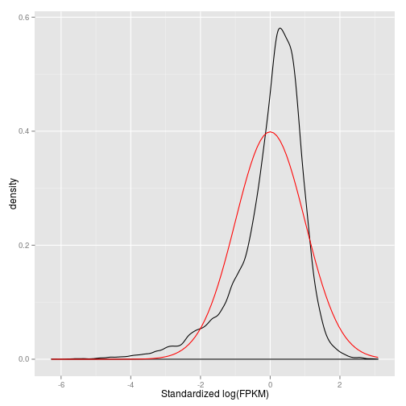 

## Select odering genes and create pseudotemperal ordering
The following sections creates a pseudotemperal ordering that tries to reflect the transdifferentiation process.  Ordering genes were selected based on differential expression in the wild type vs mutant ovary as well as the testis vs ovary data.   The ordering genes were also selected from those transcripts that are expressed in more than half the cells.  

```r
#marker_genes <- row.names(subset(fData(CDS),
#SYMBOL %in% c("Dmrt1","Foxl2","Sox8","Sox9","Cyp19a1","Ptgfr","Adcyap1")))

ordering_genes <- row.names(subset(fData(CDS), abs(cag_dmrt1_logFC) > 2 & abs(sex_logFC) > 2 ))
ordering_genes <- intersect(ordering_genes, expressed_genes)
length(ordering_genes)
```

```
## [1] 32
```

```r
fData(CDS)[ordering_genes,]
```

```
##                    Bulk_FPKM   symbol cag_dmrt1_logFC sex_logFC
## ENSMUSG00000007279    24.604   Scube2           3.104     2.629
## ENSMUSG00000007872   155.405      Id3          -2.033    -5.830
## ENSMUSG00000018417    19.807    Myo1b          -2.057    -4.715
## ENSMUSG00000020027    44.194    Socs2          -2.183    -5.216
## ENSMUSG00000021214   143.863  Akr1c18          -7.343    -7.032
## ENSMUSG00000024043    36.724 Arhgap28          -2.448    -4.218
## ENSMUSG00000024059     1.124    Clip4           2.890     5.395
## ENSMUSG00000025950   210.856     Idh1          -2.132    -3.481
## ENSMUSG00000025955   450.529   Akr1cl          -2.045    -3.074
## ENSMUSG00000026249   262.532 Serpine2          -2.250    -7.005
## ENSMUSG00000027199   365.552     Gatm           4.127     2.060
## ENSMUSG00000027445   309.328     Cst9           8.574     6.915
## ENSMUSG00000028364    17.364      Tnc          -3.179    -4.375
## ENSMUSG00000028885    85.624  Smpdl3b          -2.608    -3.536
## ENSMUSG00000029135    34.368    Fosl2          -2.049    -5.766
## ENSMUSG00000029188     1.251  Slc34a2           4.649     8.479
## ENSMUSG00000029335   109.380     Bmp3          -3.031    -4.598
## ENSMUSG00000032018    85.898     Sc5d          -2.960    -2.428
## ENSMUSG00000032220    42.440    Myo1e          -2.216    -2.751
## ENSMUSG00000032727     3.646    Mier3           2.004     2.100
## ENSMUSG00000038587    47.286   Akap12           3.739     6.462
## ENSMUSG00000038668    48.232    Lpar1           2.034     2.372
## ENSMUSG00000040152    77.004    Thbs1          -2.032    -5.567
## ENSMUSG00000041272     0.000      Tox           4.006     2.263
## ENSMUSG00000042942     6.560   Greb1l          -2.157    -4.116
## ENSMUSG00000043753    39.908   Dmrta1           4.817     2.380
## ENSMUSG00000045294   106.096   Insig1          -2.603    -2.442
## ENSMUSG00000048078    19.048    Tenm4          -2.160    -5.218
## ENSMUSG00000060879    23.325     <NA>          -2.333    -3.600
## ENSMUSG00000070933     1.427  Speer4d           2.055     6.172
## ENSMUSG00000080811    96.833     <NA>          -2.481    -2.194
## ENSMUSG00000091255     2.737  Speer4e           2.152     6.309
##                    num_cells_expressed
## ENSMUSG00000007279                  39
## ENSMUSG00000007872                  54
## ENSMUSG00000018417                  47
## ENSMUSG00000020027                  46
## ENSMUSG00000021214                  46
## ENSMUSG00000024043                  34
## ENSMUSG00000024059                  40
## ENSMUSG00000025950                  47
## ENSMUSG00000025955                  67
## ENSMUSG00000026249                  64
## ENSMUSG00000027199                  68
## ENSMUSG00000027445                  46
## ENSMUSG00000028364                  38
## ENSMUSG00000028885                  34
## ENSMUSG00000029135                  59
## ENSMUSG00000029188                  68
## ENSMUSG00000029335                  34
## ENSMUSG00000032018                  41
## ENSMUSG00000032220                  41
## ENSMUSG00000032727                  53
## ENSMUSG00000038587                  58
## ENSMUSG00000038668                  50
## ENSMUSG00000040152                  60
## ENSMUSG00000041272                  59
## ENSMUSG00000042942                  43
## ENSMUSG00000043753                  47
## ENSMUSG00000045294                  56
## ENSMUSG00000048078                  54
## ENSMUSG00000060879                  67
## ENSMUSG00000070933                  40
## ENSMUSG00000080811                  66
## ENSMUSG00000091255                  50
```

```r
CDS <- setOrderingFilter(CDS, ordering_genes)

CDS <- reduceDimension(CDS, use_irlba=FALSE)
```

```
## Reducing to independent components
```

```r
CDS <- orderCells(CDS, num_paths=1, reverse=TRUE)

plot_spanning_tree(CDS)
```

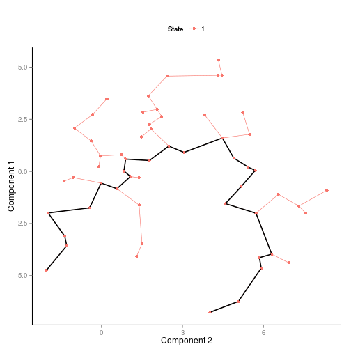 

```r
#Dmrta1
differentialGeneTest(CDS["ENSMUSG00000043753",], fullModelFormulaStr="expression~sm.ns(Pseudotime)")
```

```
##                    status            pval            qval
## ENSMUSG00000043753     OK 0.0000000004277 0.0000000004277
```

```r
plot_genes_in_pseudotime(CDS[fData(CDS)$symbol=="Dmrta1",],color_by="State",cell_size=1.5) +
  ggtitle("Dmrta1")
```

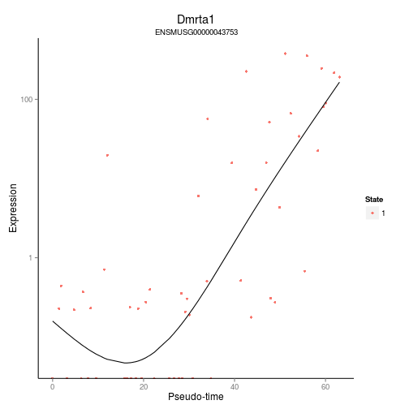 

```r
#Gatm
differentialGeneTest(CDS["ENSMUSG00000027199",], fullModelFormulaStr="expression~sm.ns(Pseudotime)")
```

```
##                    status       pval       qval
## ENSMUSG00000027199     OK 0.00002434 0.00002434
```

```r
plot_genes_in_pseudotime(CDS[fData(CDS)$symbol=="Gatm",],color_by="State",cell_size=1.5) +
  ggtitle("Gatm")
```

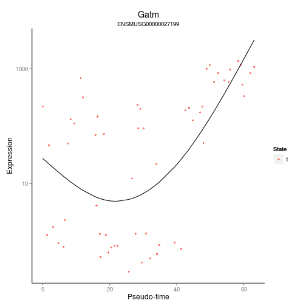 

```r
plot_symbol_in_pseudotime <- function(gene) {
  
if (gene %in% rownames(fData(CDS))) {ens_name<-gene} else {
  gene2<-paste0("^",gene,"$")
  ens_name<-rownames(fData(CDS)[grep(gene2,fData(CDS)$symbol),])
  }
print(differentialGeneTest(CDS[ens_name,], fullModelFormulaStr="expression~sm.ns(Pseudotime)"))
print(cag_dmrt1F_DF[ens_name,])
plot_genes_in_pseudotime(CDS[ens_name,],color_by="State",cell_size=3) + ggtitle(gene) + theme(legend.position="none")  
  }
```

# Single Cell Differential Expression

## Perform differential expression between Early Psudotime and Late PseudoTime
To discover candidate genes that might play a role in transdifferentiation.  We tested genes that are differentially expressed early in development for significant variation throughout pseudotime as determined above.


```r
cd<-counts(scdds)
colnames(cd)<-sapply(strsplit(colnames(cd),"_"), function(x) x[3])
#head(cd)
temp<-pData(CDS)

#define quantiles
q1<-quantile(temp$Pseudotime,1/3,type=1)
q2<-quantile(temp$Pseudotime,2/3,type=1)
  
early<-rownames(temp[temp$Pseudotime < q1,])
late<-rownames(temp[temp$Pseudotime > q2,])

cd_groups<-factor(c(rep("late",length(early)),rep("early",length(late))),levels=c("late","early"))
names(cd_groups)<-c(late,early)
table(cd_groups)
```

```
## cd_groups
##  late early 
##    18    19
```

```r
#subset cd
cd<-cd[,c(late,early)]

#clean up
cd <- cd[rowSums(cd)>0,]
cd <- cd[,colSums(cd)>1e4]

n.cores<-4
system.time(o.ifm <- scde.error.models(counts=cd,groups=cd_groups,n.cores=n.cores,threshold.segmentation=T,save.crossfit.plots=F,save.model.plots=F,verbose=1))
```

```
## cross-fitting cells.
## building individual error models.
```

```
## adjusting library size based on 2000 entries
## fitting late models:
## fitting early models:
```

```
##    user  system elapsed 
##  159.34   15.22   52.53
```

```r
#valid.cells <- o.ifm$corr.a >0;
#table(valid.cells) #all valid
o.prior <- scde.expression.prior(models=o.ifm,counts=cd,length.out=400,show.plot=F)

#Differential Expression Test
ediff <- scde.expression.difference(o.ifm,cd,o.prior,groups=cd_groups,n.randomizations=100,n.cores=n.cores,verbose=1)
```

```
## comparing groups:
## 
## early  late 
##    19    18 
## calculating difference posterior
## summarizing differences
```

```r
#add Symbol Annotation
blah<-AnnotationDbi::select(org.Mm.eg.db,keys=rownames(ediff),keytype="ENSEMBL", column="SYMBOL")
```

```
## Warning in .generateExtraRows(tab, keys, jointype): 'select' resulted in
## 1:many mapping between keys and return rows
```

```r
ediff$symbol<-blah[match(rownames(ediff),blah$ENSEMBL),"SYMBOL"]

#order on Z
ediff<-ediff[order(ediff$Z,decreasing=T),]

#add Ovary LogFC
ediff$OvaryLog2FC<-cag_dmrt1F_DF[match(rownames(ediff),rownames(cag_dmrt1F_DF)),"log2FoldChange"]
#add WT LogFC
ediff$WTLog2FC<-WT_resDF[match(rownames(ediff),rownames(WT_resDF)),"log2FoldChange"]
#add "Yes/No" for whether each gene was used in ordering
ediff$UsedForOrdering<-ifelse(rownames(ediff) %in% ordering_genes,"yes","no")

#sanity check's
temp<-c("Sox9","Foxl2","Dmrt1","Pou5f1","Gapdh","Hsd17b3","Insl3",
        "Cyp19a1","Serpine2","Mmp2","Cst9","Col1a1","Aard","Rhox8")
ediff[ediff$symbol %in% temp | ediff$UsedForOrdering == "yes",]
```

```
##                          lb      mle      ub      ce        Z          cZ
## ENSMUSG00000068522   2.6417  6.00053  8.3026  2.6417  3.21302  1.22215988
## ENSMUSG00000064137   2.2644  6.34018  8.6800  2.2644  2.92436  0.90689395
## ENSMUSG00000032220   1.3963  4.56644  8.9064  1.3963  2.85284  0.79742432
## ENSMUSG00000026249   1.3209  4.26453  8.3026  1.3209  2.84128  0.78260260
## ENSMUSG00000048078   0.5661  3.35879  6.3779  0.5661  2.35754  0.40883714
## ENSMUSG00000043753   0.5661  3.77392  9.6990  0.5661  2.29924  0.34742182
## ENSMUSG00000020027   0.0000  3.32105  8.0384  0.0000  1.97097  0.03489015
## ENSMUSG00000040152  -0.1887  3.09461  9.3216  0.0000  1.86165  0.00007554
## ENSMUSG00000027199  -0.1887  2.41531  5.0948  0.0000  1.83162  0.00007554
## ENSMUSG00000057666  -0.2642  2.90592  6.1892  0.0000  1.79987  0.00007554
## ENSMUSG00000029335  -0.3019  2.83044  7.5856  0.0000  1.79422  0.00007554
## ENSMUSG00000025955  -0.3774  2.22661  4.9816  0.0000  1.70130  0.00007554
## ENSMUSG00000021214  -1.0944  2.30209  5.6986  0.0000  1.32830  0.00007554
## ENSMUSG00000028885  -1.2077  2.11339  5.5099  0.0000  1.26654  0.00007554
## ENSMUSG00000025950  -1.2077  1.77374  5.1703  0.0000  1.16879  0.00007554
## ENSMUSG00000050397  -1.6228  1.88696  5.6609  0.0000  1.05520  0.00007554
## ENSMUSG00000024059  -1.8492  2.03792  6.1892  0.0000  1.03280  0.00007554
## ENSMUSG00000032727  -1.5850  1.73600  5.3590  0.0000  1.02563  0.00007554
## ENSMUSG00000045294  -1.6228  1.24539  4.0004  0.0000  0.83749  0.00007554
## ENSMUSG00000027445  -2.0002  1.01896  8.3404  0.0000  0.78006  0.00007554
## ENSMUSG00000032018  -2.0002  1.24539  4.7929  0.0000  0.77273  0.00007554
## ENSMUSG00000032274  -1.5473  0.00000  5.6231  0.0000  0.73774  0.00007554
## ENSMUSG00000038587  -1.9247  1.05670  4.1890  0.0000  0.69177  0.00007554
## ENSMUSG00000080811  -3.7362 -0.07548  3.5475  0.0000 -0.02899 -0.00007554
## ENSMUSG00000060879  -3.6230 -0.22644  3.1324  0.0000 -0.11216 -0.00007554
## ENSMUSG00000041272  -4.9816 -0.67931  3.5475  0.0000 -0.29302 -0.00007554
## ENSMUSG00000007872  -3.0191 -0.41513  2.1889  0.0000 -0.29579 -0.00007554
## ENSMUSG00000029188  -4.3023 -0.71704  2.8304  0.0000 -0.38249 -0.00007554
## ENSMUSG00000000567  -6.7553  0.00000  4.3777  0.0000 -0.58507 -0.00007554
## ENSMUSG00000018417  -4.7551 -1.32087  2.2644  0.0000 -0.70139 -0.00007554
## ENSMUSG00000028364  -7.0950 -3.47200  4.2645  0.0000 -0.71696 -0.00007554
## ENSMUSG00000024837  -5.2457 -1.92470  1.8870  0.0000 -0.98592 -0.00007554
## ENSMUSG00000024043  -7.9252 -2.22661  2.1134  0.0000 -1.08395 -0.00007554
## ENSMUSG00000042942  -5.8118 -2.37757  0.8680  0.0000 -1.44586 -0.00007554
## ENSMUSG00000029135  -6.1892 -2.94366 -0.1887 -0.1887 -2.07525 -0.13913204
## ENSMUSG00000070933  -7.6233 -4.49096 -0.4906 -0.4906 -2.18977 -0.25356036
## ENSMUSG00000007279  -9.3216 -5.88731 -1.6983 -1.6983 -2.72894 -0.67575221
## ENSMUSG00000091255  -8.0762 -4.83061 -1.5096 -1.5096 -2.84487 -0.78299534
## ENSMUSG00000031740  -8.5291 -4.79288 -1.6605 -1.6605 -2.99554 -0.98334254
## ENSMUSG00000001506  -9.5103 -6.52888 -3.5475 -3.5475 -4.21699 -2.35856858
## ENSMUSG00000038668 -11.2463 -8.79323 -5.0570 -5.0570 -4.60916 -2.79348241
##                      symbol OvaryLog2FC WTLog2FC UsedForOrdering
## ENSMUSG00000068522     Aard     5.46544   3.2816              no
## ENSMUSG00000064137    Rhox8     4.29467   2.3913              no
## ENSMUSG00000032220    Myo1e    -2.21555  -2.7514             yes
## ENSMUSG00000026249 Serpine2    -2.25024  -7.0046             yes
## ENSMUSG00000048078    Tenm4    -2.16035  -5.2182             yes
## ENSMUSG00000043753   Dmrta1     4.81656   2.3801             yes
## ENSMUSG00000020027    Socs2    -2.18276  -5.2156             yes
## ENSMUSG00000040152    Thbs1    -2.03167  -5.5666             yes
## ENSMUSG00000027199     Gatm     4.12749   2.0596             yes
## ENSMUSG00000057666    Gapdh    -0.56566  -3.0145              no
## ENSMUSG00000029335     Bmp3    -3.03100  -4.5982             yes
## ENSMUSG00000025955   Akr1cl    -2.04543  -3.0741             yes
## ENSMUSG00000021214  Akr1c18    -7.34308  -7.0317             yes
## ENSMUSG00000028885  Smpdl3b    -2.60768  -3.5357             yes
## ENSMUSG00000025950     Idh1    -2.13218  -3.4810             yes
## ENSMUSG00000050397    Foxl2    -1.94067  -9.2942              no
## ENSMUSG00000024059    Clip4     2.88987   5.3953             yes
## ENSMUSG00000032727    Mier3     2.00424   2.1001             yes
## ENSMUSG00000045294   Insig1    -2.60308  -2.4425             yes
## ENSMUSG00000027445     Cst9     8.57434   6.9151             yes
## ENSMUSG00000032018     Sc5d    -2.95987  -2.4276             yes
## ENSMUSG00000032274  Cyp19a1    -5.21608  -0.6262              no
## ENSMUSG00000038587   Akap12     3.73892   6.4618             yes
## ENSMUSG00000080811     <NA>    -2.48123  -2.1938             yes
## ENSMUSG00000060879     <NA>    -2.33346  -3.6003             yes
## ENSMUSG00000041272      Tox     4.00606   2.2627             yes
## ENSMUSG00000007872      Id3    -2.03256  -5.8305             yes
## ENSMUSG00000029188  Slc34a2     4.64883   8.4789             yes
## ENSMUSG00000000567     Sox9     6.74217   3.3317              no
## ENSMUSG00000018417    Myo1b    -2.05716  -4.7153             yes
## ENSMUSG00000028364      Tnc    -3.17924  -4.3748             yes
## ENSMUSG00000024837    Dmrt1    10.01802   8.8763              no
## ENSMUSG00000024043 Arhgap28    -2.44797  -4.2181             yes
## ENSMUSG00000042942   Greb1l    -2.15651  -4.1161             yes
## ENSMUSG00000029135    Fosl2    -2.04850  -5.7663             yes
## ENSMUSG00000070933  Speer4d     2.05461   6.1724             yes
## ENSMUSG00000007279   Scube2     3.10424   2.6290             yes
## ENSMUSG00000091255  Speer4e     2.15201   6.3090             yes
## ENSMUSG00000031740     Mmp2     0.30605  -5.3398              no
## ENSMUSG00000001506   Col1a1     0.03837  -3.6140              no
## ENSMUSG00000038668    Lpar1     2.03366   2.3720             yes
```
<div></div>
### Posterior Probability Curves for Cst9

```r
#Plot Expression Probability Curves
#Cst9
scde.test.gene.expression.difference("ENSMUSG00000027445",models=o.ifm,counts=cd,prior=o.prior,groups=cd_groups)
```

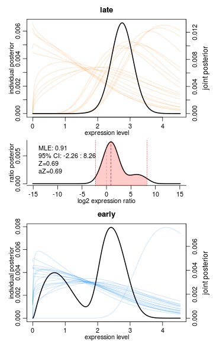 

```
##                        lb    mle    ub ce      Z     cZ
## ENSMUSG00000027445 -2.264 0.9057 8.265  0 0.6917 0.6917
```
<div></div>

```r
#col1a1
scde.test.gene.expression.difference("ENSMUSG00000001506",models=o.ifm,counts=cd,prior=o.prior,groups=cd_groups)
```

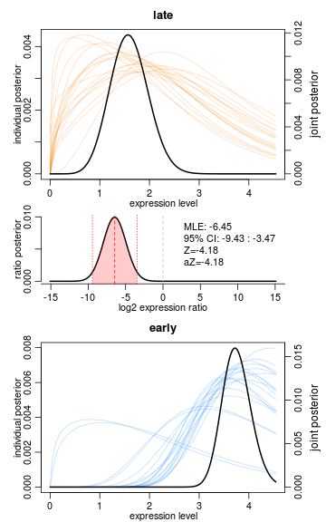 

```
##                        lb    mle     ub     ce      Z     cZ
## ENSMUSG00000001506 -9.435 -6.453 -3.472 -3.472 -4.182 -4.182
```
<div></div>
## Download published micrarray data from NCBI (GSE41948)
This first section downloads the embroyonic data from GSE41948.  It is based on the automatic output from GEO2R.


```r
gset <- getGEO("GSE41948", destdir="/mnt/afp/micah/R/umn-gcd-bioinformatics-ctv/",GSEMatrix =TRUE)
if (length(gset) > 1) idx <- grep("GPL6885", attr(gset, "names")) else idx <- 1
gset <- gset[[idx]]
colnames(pData(gset))
pData(gset)[1:5,]
rownames(pData(gset))
# make proper column names to match toptable 
fvarLabels(gset) <- make.names(fvarLabels(gset))

#Subset the C57BL/6 data

sml<-as.character(pData(gset)[,"title"])
sel<-grep("C57BL",sml)
sml<-sml[sel]
bl6<-gset[,sel]

# log2 transform
ex <- exprs(bl6)
qx <- as.numeric(quantile(ex, c(0., 0.25, 0.5, 0.75, 0.99, 1.0), na.rm=T))
LogC <- (qx[5] > 100) ||
          (qx[6]-qx[1] > 50 && qx[2] > 0) ||
          (qx[2] > 0 && qx[2] < 1 && qx[4] > 1 && qx[4] < 2)
if (LogC) { ex[which(ex <= 0)] <- NaN
  exprs(bl6) <- log2(ex) }

# set up the data and proceed with analysis
fl <- as.factor(substr(sml,10,17))
levels(fl)
bl6$description <- fl
design <- model.matrix(~ description + 0, bl6)
colnames(design) <- levels(fl)
fit <- lmFit(bl6, design)
cont_matrix_11.6 <- makeContrasts(XX_E11.6-XY_E11.6, levels=design)
cont_matrix_11.8 <- makeContrasts(XX_E11.8-XY_E11.8, levels=design)
cont_matrix_12.0 <- makeContrasts(XX_E12.0-XY_E12.0, levels=design)
fit_11.6 <- contrasts.fit(fit, cont_matrix_11.6)
fit_11.8 <- contrasts.fit(fit, cont_matrix_11.8)
fit_12.0 <- contrasts.fit(fit, cont_matrix_12.0)
fit_11.6 <- eBayes(fit_11.6, 0.01)
fit_11.8 <- eBayes(fit_11.8, 0.01)
fit_12.0 <- eBayes(fit_12.0, 0.01)
tT_11.6 <- topTable(fit_11.6, adjust="fdr", sort.by="none", number=nrow(ex))
tT_11.8 <- topTable(fit_11.8, adjust="fdr", sort.by="none", number=nrow(ex))
tT_12.0 <- topTable(fit_12.0, adjust="fdr", sort.by="none", number=nrow(ex))
mean(rownames(tT_11.8)==rownames(tT_12.0))
tT<-tT_12.0
colnames(tT)
tT$logFC_11.6 <- tT_11.6$logFC
tT$padj_11.6 <- tT_11.6$adj.P.Val
tT$logFC_11.8 <- tT_11.8$logFC
tT$padj_11.8 <- tT_11.8$adj.P.Val

# load NCBI platform annotation
gpl <- annotation(gset)
platf <- getGEO(gpl, destdir="/mnt/afp/micah/R/umn-gcd-bioinformatics-ctv/", AnnotGPL=TRUE)
ncbifd <- data.frame(attr(dataTable(platf), "table"))

# replace original platform annotation
tT <- tT[setdiff(colnames(tT), setdiff(fvarLabels(bl6), "ID"))]
tT <- merge(tT, ncbifd, by="ID")
tT <- tT[order(-tT$logFC), ]  # restore correct order

tT <- subset(tT, select=c("ID","padj_11.6","padj_11.8","adj.P.Val","t","B", 
                          "logFC_11.6","logFC_11.8","logFC","Gene.symbol","Gene.ID"))
tT<-tT[tT$adj.P.Val<0.05 | tT$padj_11.8<0.05 | tT$padj_11.6<0.05,]

#load expression values into variable ex
ex<-as.data.frame(exprs(bl6))
colnames(ex)<-paste0(substr(sml,10,17),substr(sml,24,28))
ex$probe<-rownames(ex)

save(ex,tT,file="GSE41948.rdata")
```

## Vizualize early gene expression changes for male and female
This section creates a function that will plot the microarray data for a given gene.


```r
load(file="inst/extdata/GSE41948.rdata")

plotEmbryonicData <- function(gene) {
ids=as.character(tT[grep(paste0("^", gene, "$"),tT$Gene.symbol),"ID"])
temp<-melt(ex[ids,],id.vars="probe",factorsAsStrings=T)
temp$sex<-as.factor(unlist(strsplit(as.character(temp$variable),
                                    "_"))[seq(from = 1, to = 3 * nrow(temp), by = 3)])
temp$time<-as.factor(unlist(strsplit(as.character(temp$variable),
                                     "_"))[seq(from = 1, to = 3 * nrow(temp), by = 3)+1])
temp<-temp[,-grep("variable",colnames(temp))]
p <- ggplot(temp, aes(x = time, y = value, fill = sex)) + facet_grid(. ~ probe)
    p + geom_boxplot() + theme_bw() + ggtitle(gene)
}

plotEmbryonicData("Sox9")
```

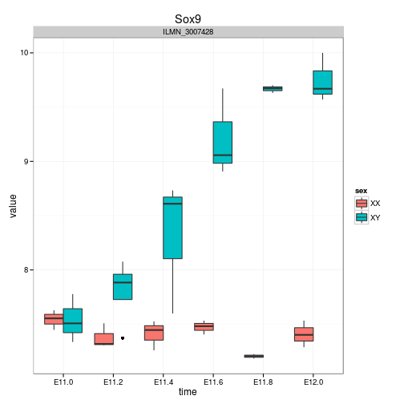 

###Write out Supplemental Table 1c

```r
#Add "Yes/No" for differentially expressed embyronically
# Differentially expressed at E11.6,E11.8 or E12.0 in Black6 mice
suppressWarnings(early_dimorphic_genes <- 
  AnnotationDbi::select(org.Mm.eg.db, keys=tT$Gene.ID, columns="ENSEMBL",keytype="ENTREZID")$ENSEMBL)
ediff$EmbryonicallyDimorphic<-ifelse(rownames(ediff) %in% early_dimorphic_genes,"yes","no")


ediff_subset<-ediff[abs(ediff$cZ) > 0.1 | ediff$UsedForOrdering == "yes",]
table(ediff_subset[ediff$UsedForOrdering=="no",]$EmbryonicallyDimorphic)
```

```
## 
##  no yes 
## 777  56
```

```r
colnames(ediff_subset)[1:6]<-c("LowerBound FoldChange","Maximum Likelihood FoldChange",
                               "Upperbound FoldChange","Conservative Estimate FoldChange",
                               "Uncorrected Z-Score","Z-Score Corrected for Multiple Testing")
write.csv(ediff_subset,"Supplemental_Table_1c.csv",quote=F)
```

##Create Figure 3C
Now that we have access to embryonic expression data, we can plot the expression of a gene in pseudotime side by side its expression in early development.   

```r
temp<-c("Serpine2","Cst9","Aard","Rhox8","Col1a1","Mmp2")
a<-list()
b<-list()

for (gene in temp) {
    a[[gene]]<-plot_symbol_in_pseudotime(gene)
    if  (gene %in% tT$Gene.symbol) {
      print(gene)
      b[[gene]]<-plotEmbryonicData(gene)
      grid.arrange(b[[gene]],a[[gene]], ncol=1, main = gene)
    } else {
      grid.arrange(a[[gene]], ncol=1, main = gene)
    }
}
```

```
##                    status          pval          qval
## ENSMUSG00000026249     OK 0.00000002662 0.00000002662
##                    baseMean log2FoldChange  lfcSE   stat    pvalue
## ENSMUSG00000026249     6156          -2.25 0.1784 -12.61 1.748e-36
##                         padj   symbol ENTREZID  CHR raClass
## ENSMUSG00000026249 1.969e-34 Serpine2    20720 chr1       0
## [1] "Serpine2"
```

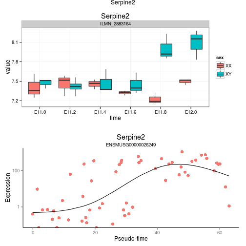 

```
##                    status   pval   qval
## ENSMUSG00000027445     OK 0.0299 0.0299
##                    baseMean log2FoldChange  lfcSE  stat   pvalue      padj
## ENSMUSG00000027445     3256          8.574 0.9419 9.103 8.76e-20 3.521e-18
##                    symbol ENTREZID  CHR raClass
## ENSMUSG00000027445   Cst9    13013 chr2       0
## [1] "Cst9"
```

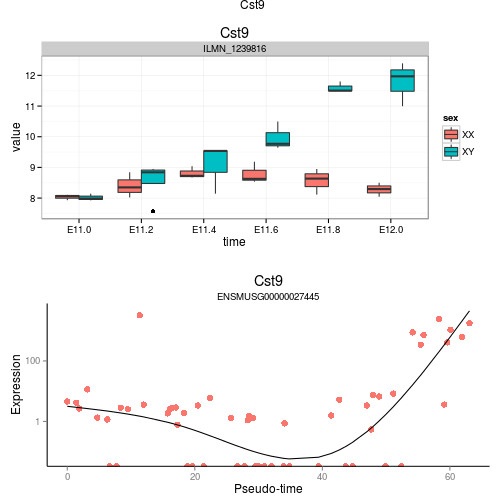 

```
##                    status        pval        qval
## ENSMUSG00000068522     OK 0.000008701 0.000008701
##                    baseMean log2FoldChange  lfcSE  stat     pvalue
## ENSMUSG00000068522     7250          5.465 0.1776 30.77 6.254e-208
##                          padj symbol ENTREZID   CHR raClass
## ENSMUSG00000068522 7.077e-204   Aard   239435 chr15       0
## [1] "Aard"
```

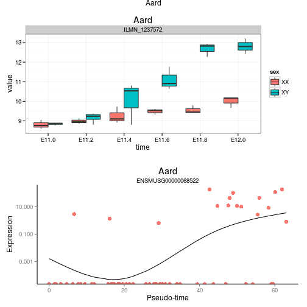 

```
##                    status      pval      qval
## ENSMUSG00000064137     OK 0.0004515 0.0004515
##                    baseMean log2FoldChange  lfcSE  stat   pvalue      padj
## ENSMUSG00000064137    830.4          4.295 0.4197 10.23 1.41e-24 8.141e-23
##                    symbol ENTREZID  CHR raClass
## ENSMUSG00000064137  Rhox8   434768 chrX       0
## [1] "Rhox8"
```

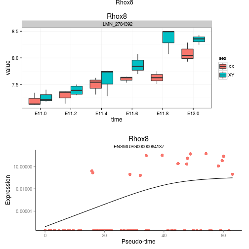 

```
##                    status      pval      qval
## ENSMUSG00000001506     OK 4.975e-15 4.975e-15
##                    baseMean log2FoldChange  lfcSE    stat pvalue   padj
## ENSMUSG00000001506     2987        0.03837 0.7741 0.04957 0.9605 0.9768
##                    symbol ENTREZID   CHR raClass
## ENSMUSG00000001506 Col1a1    12842 chr11       0
```

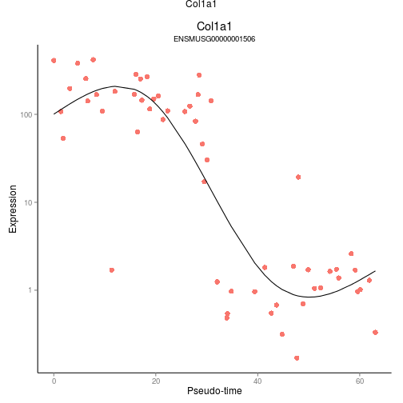 

```
##                    status         pval         qval
## ENSMUSG00000031740     OK 0.0000004774 0.0000004774
##                    baseMean log2FoldChange  lfcSE   stat pvalue   padj
## ENSMUSG00000031740     2101         0.3061 0.4618 0.6627 0.5075 0.6726
##                    symbol ENTREZID  CHR raClass
## ENSMUSG00000031740   Mmp2    17390 chr8       1
## [1] "Mmp2"
```

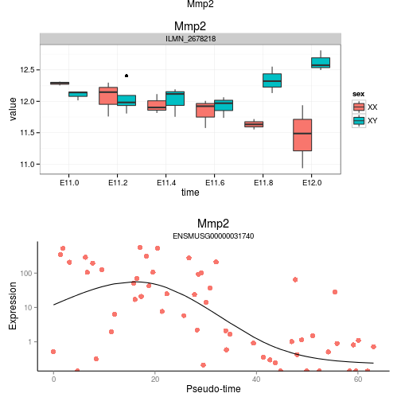 

```r
grid.arrange(a[[1]],a[[2]],a[[3]],a[[4]],a[[5]],a[[6]],ncol=3,main="Dimorphic Genes in Pseudotime")
```

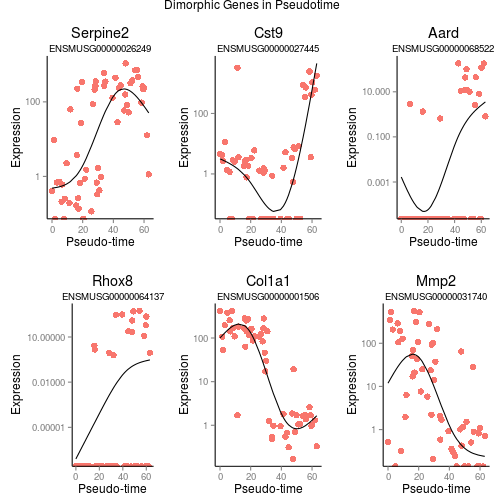 


# Session Info

```r
sessionInfo()
```

```
## R version 3.1.1 (2014-07-10)
## Platform: x86_64-pc-linux-gnu (64-bit)
## 
## locale:
##  [1] LC_CTYPE=en_US.UTF-8 LC_NUMERIC=C         LC_TIME=C           
##  [4] LC_COLLATE=C         LC_MONETARY=C        LC_MESSAGES=C       
##  [7] LC_PAPER=C           LC_NAME=C            LC_ADDRESS=C        
## [10] LC_TELEPHONE=C       LC_MEASUREMENT=C     LC_IDENTIFICATION=C 
## 
## attached base packages:
##  [1] splines   stats4    parallel  grid      stats     graphics  grDevices
##  [8] utils     datasets  methods   base     
## 
## other attached packages:
##  [1] RColorBrewer_1.0-5        R.utils_1.34.0           
##  [3] R.oo_1.18.0               R.methodsS3_1.6.1        
##  [5] dplyr_0.3.0.2             limma_3.22.1             
##  [7] GEOquery_2.32.0           scde_1.2.1               
##  [9] flexmix_2.3-12            lattice_0.20-29          
## [11] monocle_1.0.0             plyr_1.8.1               
## [13] igraph_0.7.1              HSMMSingleCell_1.0.0     
## [15] VGAM_0.9-5                org.Mm.eg.db_3.0.0       
## [17] RSQLite_1.0.0             DBI_0.3.1                
## [19] GenomicAlignments_1.2.1   Rsamtools_1.18.2         
## [21] Biostrings_2.34.0         XVector_0.6.0            
## [23] GenomicFeatures_1.18.2    AnnotationDbi_1.28.1     
## [25] DESeq2_1.6.2              RcppArmadillo_0.4.550.1.0
## [27] Rcpp_0.11.3               BiocParallel_1.0.0       
## [29] biomaRt_2.22.0            NMF_0.20.5               
## [31] bigmemory_4.4.6           BH_1.54.0-5              
## [33] bigmemory.sri_0.1.3       Biobase_2.26.0           
## [35] cluster_1.15.2            rngtools_1.2.4           
## [37] pkgmaker_0.22             registry_0.2             
## [39] rtracklayer_1.26.2        GenomicRanges_1.18.3     
## [41] GenomeInfoDb_1.2.3        IRanges_2.0.0            
## [43] S4Vectors_0.4.0           ggbio_1.14.0             
## [45] BiocGenerics_0.12.1       biovizBase_1.14.0        
## [47] gridExtra_0.9.1           reshape2_1.4             
## [49] ggplot2_1.0.0             knitr_1.8                
## 
## loaded via a namespace (and not attached):
##  [1] BBmisc_1.8               BSgenome_1.34.0         
##  [3] BatchJobs_1.5            Cairo_1.5-6             
##  [5] Formula_1.1-2            GGally_0.5.0            
##  [7] Hmisc_3.14-6             MASS_7.3-35             
##  [9] Matrix_1.1-3             OrganismDbi_1.8.0       
## [11] RBGL_1.42.0              RCurl_1.95-4.4          
## [13] Rook_1.1-1               SparseM_1.05            
## [15] VariantAnnotation_1.12.5 XML_3.98-1.1            
## [17] acepack_1.3-3.3          annotate_1.44.0         
## [19] assertthat_0.1           base64enc_0.1-2         
## [21] bitops_1.0-6             brew_1.0-6              
## [23] checkmate_1.5.0          codetools_0.2-8         
## [25] colorspace_1.2-4         combinat_0.0-8          
## [27] dichromat_2.0-0          digest_0.6.3            
## [29] doParallel_1.0.8         edgeR_3.8.5             
## [31] evaluate_0.5.5           fail_1.2                
## [33] fastICA_1.2-0            foreach_1.4.2           
## [35] foreign_0.8-61           formatR_1.0             
## [37] genefilter_1.48.1        geneplotter_1.44.0      
## [39] graph_1.44.0             gridBase_0.4-7          
## [41] gtable_0.1.2             irlba_1.0.3             
## [43] iterators_1.0.7          labeling_0.3            
## [45] latticeExtra_0.6-26      locfit_1.5-9.1          
## [47] magrittr_1.5             matrixStats_0.10.3      
## [49] modeltools_0.2-21        munsell_0.4.2           
## [51] nnet_7.3-8               proto_0.3-10            
## [53] quantreg_5.05            reshape_0.8.5           
## [55] rjson_0.2.15             rpart_4.1-8             
## [57] scales_0.2.4             sendmailR_1.2-1         
## [59] stringr_0.6.2            survival_2.37-7         
## [61] tools_3.1.1              xtable_1.7-1            
## [63] zlibbioc_1.12.0
```

